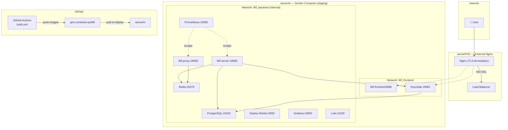

# Deploy & Operations — LKFL

> **Единый источник правды по выкатке, эксплуатации и операционным процедурам.**
> Если ты тратишь полдня на деплой — значит не прочитал этот документ.

---

## §TL;DR

### Окружения

| Env | URL | Сервер | Compose | Мониторинг | Auto-deploy | Назначение |
|-----|-----|--------|---------|-----------|-------------|-----------|
| **Local/Dev** | `localhost:5173` + `localhost:8080` | Твой ноутбук | `docker-compose.dev.yml` | Нет | — | Разработка |
| **Staging** | `dev.april.ukituki.tech` | serverAi (192.168.1.27) | `docker-compose.staging.yml` | Profile: monitoring | ✅ dev push | Интеграционные тесты, preview |
| **Production** | `lkf.co` (план) | serverPr01 → serverAi | `docker-compose.prod.yml` | Profile: monitoring | ❌ manual | Production |

### Быстрый справочник: «что делать когда…»

| Симптом | Решение |
|---------|---------|
| Сервис не стартует после deploy | `docker compose -f docker-compose.staging.yml -p lkfl-staging logs --tail=50` |
| 502 на все endpoint'ы | Нginx upstream → проверить `docker ps` → Б-006 |
| Callback 401 | Б-003: Redis state, Б-007: token type |
| 500 на callback | Б-004: миграции, Б-005: issuer |
| Keycloak unhealthy | Б-002: hostname config, start_period 90s |
| Tenant not found | Б-008: X-Tenant-ID header |
| Docker disk full | `docker system prune -f && docker volume ls` |
| OOM kill | Увеличить memory limit в compose |
| Migration hang | `docker exec lkfl-staging-postgres-1 psql -U lkfl -c "SELECT * FROM pg_locks;"` |
| Need rollback | §3.4 — Rollback |

### Deploy checklist (staging)

```
Pre:
  □ CI зелёный (lint-test пройден)
  □ Миграции backward-compatible (§4)
  □ .env.staging актуален (секреты не истекли)

Deploy (автоматический при push в dev):
  □ build.yml → build-push → deploy-staging → smoke-test → e2e-staging

Post:
  □ curl -sf https://dev.april.ukituki.tech/healthz → 200
  □ Login flow работает (Keycloak → callback → dashboard)
  □ Grafana дашборды обновляются
```

---

## §1 — Окружения

### Local / Dev

```bash
# Backend
docker compose -f docker-compose.dev.yml up -d

# Frontend (Vite dev server)
cd frontend && npm run dev

# URLs
# Frontend: http://localhost:5173
# Backend:  http://localhost:8080
# Keycloak: http://localhost:9081
# Grafana:  http://localhost:3000 (если --profile monitoring)
```

**Особенности:**
- `build:` в compose — собирает образы локально
- Vite dev server — hot reload для фронтенда
- Keycloak `start-dev` — быстрый старт, без production hardening
- Redis без password
- Мониторинг через docker profile: `--profile monitoring`

### Staging (dev.april.ukituki.tech)

**Сервер:** serverAi — Debian 13, 30GB RAM, 16 CPU, 221GB disk, Docker 29.4, Compose 5.1

**Сеть:**
```
Internet → serverPr01 (external nginx, TLS) → serverAi (192.168.1.27:8086)
```

**Port mapping:**

| Service | Container port | Host port | Внешний доступ |
|---------|---------------|-----------|---------------|
| lkfl-server | 8080 | 18080 | localhost only |
| lkfl-proxy | 8090/8091 | 18090/18091 | localhost only |
| lkfl-frontend | 80 | 8086 | 127.0.0.1 |
| Keycloak | 8080 | 19081 | localhost only |
| PostgreSQL | 5432 | 15432 | localhost only |
| Redis | 6379 | 16379 | localhost only |
| Deploy Worker | 9092 | 9092 | localhost only |
| Prometheus | 9090 | 19090 | localhost only |
| Grafana | 3000 | 13000 | localhost only |
| Loki | 3100 | 13100 | localhost only |

**Особенности:**
- `image:` из GHCR — не собирает локально
- Keycloak `start-dev` — быстрый режим
- Redis без password (staging-only)
- Monitoring через Docker profile
- Auto-deploy при push в dev
- Volume prefix: `staging_`

### Production

**Особенности:**
- Keycloak `start` — production mode
- Redis с password (`requirepass`)
- Все порты на `127.0.0.1` (не exposed наружу)
- Nginx в compose (internal reverse proxy)
- Manual deploy через `workflow_dispatch`
- Volume prefix: `lkfl_prod_`
- Resource limits строже

### Различия между окружениями

| Параметр | Dev | Staging | Production |
|----------|-----|---------|------------|
| Build | `build:` local | `image:` GHCR | `image:` GHCR |
| Keycloak mode | start-dev | start-dev | start |
| Keycloak version | 26.x | 25.0 | 26.0 |
| Redis password | Нет | Нет | Обязателен |
| Nginx | External (serverPr01) | External (serverPr01) | Internal + External |
| Monitoring | Optional | Profile | Profile |
| Auto-deploy | Нет | Да (dev push) | Нет (manual) |
| Frontend | Vite dev | Docker image | Docker image |
| Frontend port | 5173 | 8086 | 3000 |
| Volume prefix | — | staging_ | lkfl_prod_ |
| Network isolation | Нет | backend internal | backend internal |

---

## §2 — Архитектура деплоя



### CI/CD Pipeline (build.yml — 8 job'ов)

```
developer → git push dev       → staging auto-deploy
developer → git push main      → production (manual dispatch)
    │
    ├── 1. lint-test (self-hosted lkfl runner)
    │     ├── Go: mod tidy, vet, test -short, golangci-lint
    │     ├── Frontend: npm ci, eslint, tsc --noEmit, vitest
    │     ├── OpenAPI: redocly lint
    │     └── Config: docker-compose validation
    │
    ├── 2. e2e-local (self-hosted lkfl runner)
    │     ├── Vite dev server
    │     └── Playwright chromium tests
    │
    ├── 3. build-push (self-hosted lkfl runner, matrix)
    │     ├── Docker Buildx login GHCR
    │     ├── server → ghcr.io/.../server:{tag}
    │     ├── proxy → ghcr.io/.../proxy:{tag}
    │     ├── frontend → ghcr.io/.../frontend:{tag}
    │     └── deploy-worker → ghcr.io/.../deploy-worker:{tag}
    │
    ├── 4. deploy-staging (auto on dev push)
    │     ├── Sync compose + env to serverAi
    │     ├── Pull images from GHCR
    │     ├── Run migrations (retry 3x)
    │     ├── Run seed
    │     ├── docker compose down → up -d
    │     └── Health check polling (10 attempts × 15s)
    │
    ├── 5. smoke-test-staging
    │     └── infra/smoke-test.sh --retry 5
    │
    ├── 6. e2e-staging (continue-on-error)
    │     └── Playwright against dev.april.ukituki.tech
    │
    └── 7. deploy-production (manual workflow_dispatch)
          └── Аналогично staging но для prod compose
```

### Docker Registry

```
ghcr.io/ukituki-ps/lkfl/
├── server:{tag}
├── proxy:{tag}
├── frontend:{tag}
└── deploy-worker:{tag}

Tag strategy:
  dev push → dev-{short-sha} + dev-latest
  main push → main-{short-sha} + main-latest
  PR → pr-{number}-{short-sha}
  release → v{major}.{minor}.{patch}
```

---

## §3 — Процесс выкатки

### 3.1 Staging (автоматический)

**Триггер:** `git push origin dev`

**Полная последовательность:**

```
1. CI: lint-test → 3-5 мин
2. CI: build-push → 5-8 мин (4 образа × Buildx)
3. CD: deploy-staging → 3-5 мин
   a. Sync docker-compose.staging.yml + .env.staging → /home/ukituki/LKFL-staging/
   b. Update IMAGE_TAG в .env.staging
   c. Pull images: docker compose pull (server, proxy, frontend, deploy-worker)
   d. Migrations: docker compose run --rm lkfl-migrate (retry 3x, 10s между)
   e. Seed: docker compose run --rm lkfl-seed
   f. Stop old: docker compose down
   g. Start new: docker compose up -d
   h. Ensure keycloak DB exists
   i. Health check: /healthz polling (10 attempts × 15s)
   j. Clean old images: docker image prune -f
4. Smoke test: infra/smoke-test.sh (retry 5x, 10s между)
5. E2E staging: Playwright against real staging (continue-on-error)
```

**Общее время:** ~15-25 минут от push до healthy staging.

**Downtime:** ~30-60 секунд между `compose down` и `compose up` + health check.

### 3.2 Production (ручной)

**Триггер:** `workflow_dispatch` в GitHub Actions UI.

**Отличия от staging:**
- `docker-compose.prod.yml` вместо `staging`
- `.env.prod` вместо `.env.staging`
- Redis с password
- Keycloak `start` mode (не `start-dev`)
- Internal nginx в compose
- Port mapping на `127.0.0.1` только

**Процесс:**
```
1. Убедиться что staging healthy (smoke + e2e прошли)
2. GitHub Actions → Actions → Build & Deploy → Run workflow
3. Выбрать branch (обычно main)
4. Wait → lint → build → deploy-production → health check
5. Manual verification на production URL
```

### 3.3 Ручной деплой конкретного образа

Полезно для тестирования без пуша в dev:
- CI собирает образы для любой ветки (tag: `{branch}-{sha}`)
- Ручной депloy на staging:
  ```bash
  # На serverAi
  cd /home/ukituki/LKFL-staging
  sed -i 's/IMAGE_TAG=.*/IMAGE_TAG=some-branch-a1b2c3d/' .env.staging
  docker compose -f docker-compose.staging.yml pull
  docker compose -f docker-compose.staging.yml down && docker compose up -d
  ```

### 3.4 Rollback

**Быстрый rollback (2 минуты):**

```bash
# 1. Найти предыдущий IMAGE_TAG
cat /home/ukituki/LKFL-staging/.env.staging.backup*
# или
docker image ls ghcr.io/ukituki-ps/lkfl/server --format "{{.Repository}}:{{.Tags}}" | head -10

# 2. Подставить предыдущий tag
sed -i 's/^IMAGE_TAG=main-bad123$/IMAGE_TAG=main-good456/' /home/ukituki/LKFL-staging/.env.staging

# 3. Rollback (без migration!)
cd /home/ukituki/LKFL-staging
export IMAGE_TAG=main-good456
export GHCR_REGISTRY=ghcr.io/ukituki-ps/lkfl
docker compose -f docker-compose.staging.yml -p lkfl-staging down
docker compose -f docker-compose.staging.yml -p lkfl-staging pull
docker compose -f docker-compose.staging.yml -p lkfl-staging up -d

# 4. Health check
curl -sf http://127.0.0.1:18080/healthz && echo "OK" || echo "FAIL"
```

**Важно:** rollback НЕ запускает migrations. Если migration провалилась → §4.3.

**Auto rollback:** при health check failure в CI pipeline — автоматически POST на `/rollback` Deploy Worker.

**Подробнее:** ADR-039 (Rollback Strategy).

---

## §4 — Миграции БД

### 4.1 Как работают

```
lkfl-server бинарник:
  cmd/server/main.go
    → subcommand "migrate" → golang-migrate → SQL файлы из migrations/

docker compose run --rm lkfl-migrate
  → запускает lkfl-server:migrate внутри контейнера
  → применяет все pending миграции
  → записывает применённые в schema_migrations
```

**Расположение:** `backend/migrations/` — SQL файлы в формате `{timestamp}_{name}.sql`.

### 4.2 Retry strategy

В CI/CD pipeline миграции выполняются с retry:
```yaml
# 3 попытки, 10s между
for i in 1 2 3; do
  if docker compose run --rm lkfl-migrate; then
    break
  fi
  sleep 10
done
```

**Почему retry:** PostgreSQL может не быть полностью ready после `service_healthy` (wals, connections).

### 4.3 Что делать при провале миграции

```bash
# 1. Остановить всё
docker compose -f docker-compose.staging.yml -p lkfl-staging down

# 2. Диагностика
docker compose -f docker-compose.staging.yml -p lkfl-staging run --rm postgres psql \
  -U lkfl -d lkfl_platform -c "\dt"
docker compose -f docker-compose.staging.yml -p lkfl-staging run --rm postgres psql \
  -U lkfl -d lkfl_platform -c "SELECT * FROM schema_migrations ORDER BY version DESC LIMIT 5;"

# 3. Варианты:
#    A: Migration частично применена — удалить из schema_migrations + rollback образа
#    B: Migration создала таблицу — оставить, старый сервер не знает о ней (OK)
#    C: Migration изменила таблицу — проверить backward compatibility

# 4. Rollback образа (БЕЗ повторной migration)
#    §3.4 — Rollback procedure
```

### 4.4 Expand/Contract pattern

**ВСЕ миграции должны быть backward-compatible со старым кодом.**

| ✅ Безопасно | ❌ Небезопасно |
|-------------|---------------|
| `CREATE TABLE` | `DROP COLUMN` |
| `ADD COLUMN col DEFAULT value` | `DROP TABLE` |
| `ADD COLUMN col NOT NULL DEFAULT value` | `ALTER COLUMN col TYPE` (без проверки) |
| `CREATE INDEX` | `RENAME COLUMN` |

**Полный цикл expand/contract:**

```
Деплой 1 (Expand):
  Migration: ADD COLUMN new_col VARCHAR(255) DEFAULT ''
  Code: if new_col set → use new_col, else use old_col

Деплой 2:
  Code: use only new_col (old_col игнорируется)

Деплой 3 (Contract):
  Migration: ALTER TABLE DROP COLUMN old_col
```

**Чек-лист перед миграцией:**
```
□ Миграция backward-compatible? (старый сервер работает с новой схемой)
□ Есть default value для новых колонок?
□ Новый индекс не блокирует writes на большую таблицу? (CONCURRENTLY)
□ Тестировал миграцию на staging?
□ Есть план rollback? (§3.4)
```

---

## §5 — Секреты (Secrets Management)

### Текущее состояние

| Секрет | Где хранится | Где используется |
|--------|-------------|-----------------|
| `POSTGRES_PASSWORD` | `.env.staging` / `.env.prod` | PostgreSQL, Keycloak DB connection |
| `REDIS_PASSWORD` | `.env.prod` | Redis (production only) |
| `KEYCLOAK_ADMIN_PASSWORD` | `.env.*` | Keycloak admin |
| `KEYCLOAK_CLIENT_SECRET` | `.env.*` | OAuth2 client credentials flow |
| `JWT_SECRET` | `.env.*` | JWT token signing |
| `SENTRY_DSN` | `.env.*` | Sentry error tracking |
| `GHCR_PAT` | GH Actions secrets | Docker registry auth в CI |
| `DEPLOY_TOKEN` | `.env.*` + GH Actions | Deploy Worker webhook auth |
| `WEBHOOK_SECRET` | `.env.*` | Provider webhook signature verification |

### Правила

1. **`.env.*` в `.gitignore`** — никогда не коммитить реальные секреты
2. **`.env.*.example` в git** — шаблон с placeholder'ами
3. **GH Actions secrets** — для CI/CD pipeline
4. **Никогда в чат/коммит/лог** — секрет не должен попасть в текстовый вывод
5. **Rotation при инциденте** — заменить секрет + обновить все .env + restart сервисы

### Rotation procedure

```bash
# Пример: ротация JWT_SECRET

# 1. Сгенерировать новый секрет
openssl rand -hex 32

# 2. Обновить .env.staging на serverAi
echo "JWT_SECRET=новый_секрет" >> /home/ukituki/LKFL-staging/.env.staging

# 3. Обновить .env.prod на serverAi (если production)

# 4. Перезапустить сервисы
docker compose -f docker-compose.staging.yml -p lkfl-staging restart lkfl-server

# 5. Все существующие JWT токены становятся невалидными → users need to re-login
#    Принято для security incident. Для planned rotation — использовать dual-secret period.
```

### Roadmap

| Фаза | Метод | Когда |
|------|-------|-------|
| Phase 1 | .env files + GH Actions | Сейчас |
| Phase 2 | Mozilla SOPS + age | M38 (F3 Hardening) |
| Phase 3 | HashiCorp Vault | M44 (F4 Hardening) |

**Подробнее:** ADR-041 (Secrets Management Roadmap).

---

## §6 — Disaster Recovery

### 6.1 Backup

| Компонент | Метод | Частота | Хранение |
|-----------|-------|---------|---------|
| PostgreSQL | `pg_dump --format=custom --compress=6` | Daily 03:00 MSK | 30 дней local |
| PostgreSQL (full) | `pg_dumpall --clean` | Weekly Sunday 04:00 | 90 дней |
| Redis | AOF (everysec) + RDB (60s) | Continuous | Docker volume |
| Keycloak DB | Включён в PostgreSQL backup | — | — |
| Keycloak realm | JSON в git (`infra/keycloak/`) | На каждый commit | Git |

**Cron на serverAi:**
```bash
# Daily PostgreSQL backup
0 3 * * * docker exec lkfl-staging-postgres-1 pg_dump -U lkfl -d lkfl_platform --format=custom --compress=6 -f /backup/lkfl/pg_$(date +\%Y\%m\%d).dump

# Weekly full backup
0 4 * * 0 docker exec lkfl-staging-postgres-1 pg_dumpall -U lkfl --clean --if-exists | gzip > /backup/lkfl/full_$(date +\%Y\%m\%d).sql.gz

# Cleanup old backups (keep 30 days)
0 5 * * * find /backup/lkfl/ -name "*.dump" -mtime +30 -delete
0 5 * * * find /backup/lkfl/ -name "*.sql.gz" -mtime +90 -delete
```

### 6.2 Restore

**Полный restore PostgreSQL:**
```bash
# 1. Остановить сервер
docker compose -f docker-compose.staging.yml -p lkfl-staging down

# 2. Очистить volume
docker volume rm lkfl-staging_staging_pg_data

# 3. Поднять пустой postgres
docker compose -f docker-compose.staging.yml -p lkfl-staging up -d postgres

# 4. Восстановить из бэкапа
docker exec -i lkfl-staging-postgres-1 pg_restore -U lkfl -d lkfl_platform --clean --if-exists /backup/lkfl/pg_20260602.dump

# 5. Поднять остальные сервисы
docker compose -f docker-compose.staging.yml -p lkfl-staging up -d
```

### 6.3 RTO / RPO

| Окружение | RTO | RPO |
|-----------|-----|-----|
| Staging | 4 часа (manual) | 1 час (daily backup) |
| Production (план) | 1 час | 5 мин (WAL archiving) |

### 6.4 DR тестирование

**Частота:** quarterly
**Процедура:**
1. Поднять временный postgres
2. Восстановить из последнего бэкапа
3. Проверить: `\dt`, `\d+ table`, `SELECT count(*) FROM users`
4. Уничтожить временный контейнер
5. Записать результат в этот документ

**DR Test Log:**

| Дата | Окружение | Результат | Время restore | Примечание |
|------|-----------|-----------|---------------|-----------|
| — | — | Не тестировано | — | Запланировать после M22 |

### 6.5 ФСТЭК / 152-ФЗ

| Требование | Реализация |
|------------|-----------|
| Данные ПДн в РФ | serverAi — физически в РФ |
| Backup ПДн | PostgreSQL backup включает таблицы с ПДн |
| Audit log retention | 90 дней minimum (Loki) |
| Защита бэкапов | File permissions + server access control |
| Тестирование restore | Quarterly DR test |

**Подробнее:** ADR-040 (Backup and Disaster Recovery).

---

## §7 — Observability и Runbook

### 7.1 Что мониторим

**Prometheus метрики (lkfl-server + lkfl-proxy):**

| Метрика | Тип | Описание |
|---------|-----|----------|
| `http_requests_total` | Counter | Запросы по method/path/status |
| `http_request_duration_seconds` | Histogram | Latency запросов |
| `go_goroutines` | Gauge | Активные goroutines |
| `go_memstats_alloc_bytes` | Gauge | Выделенная память |
| `cel_generation_total` | Counter | CEL expression generation |
| `cel_evaluation_total` | Counter | CEL evaluation |
| `provider_request_total` | Counter | Запросы к провайдерам |
| `circuit_breaker_state` | Gauge | Circuit breaker state per provider |

**Grafana дашборды:**

| Дашборд | Источник | Показатели |
|---------|----------|-----------|
| Platform Overview | Prometheus | RPS, latency, errors, uptime |
| Backend Metrics | Prometheus | goroutines, memstats, HTTP |
| Provider Health | Prometheus | latency, errors, circuit breaker |
| User Activity | Prometheus | active users, catalog views |
| Security | Prometheus | failed_auth, rate_limit |
| Infrastructure | Prometheus | CPU, memory, disk |
| Application Logs | Loki → Grafana | JSON logs с filter |

**Loki логи:**
- Format: JSON с `tenant_id`, `level`, `svc`
- Retention: 15 дней (configurable в prometheus.yml)
- Filter: `{svc="lkfl-server"} |= "error"`

### 7.2 Alerts

**Grafana alerting rules (`infra/grafana/alerting/rules.yml`):**

| Alert | Condition | Severity |
|-------|-----------|----------|
| Server down | `/healthz` unreachable 5 мин | Critical |
| High error rate | >5% 5xx за 5 мин | Warning |
| High latency | p99 > 2s за 5 мин | Warning |
| Memory usage | >80% limit за 10 мин | Warning |
| Disk usage | >85% за 30 мин | Warning |
| Redis down | Redis unreachable 1 мин | Critical |
| PostgreSQL down | PG unreachable 1 мин | Critical |
| Keycloak down | KC unhealthy 5 мин | Critical |

### 7.3 Runbook

#### Server не стартует

```bash
# 1. Логи
docker compose -f docker-compose.staging.yml -p lkfl-staging logs --tail=100 lkfl-server

# 2. Проверить зависимости
docker compose -f docker-compose.staging.yml -p lkfl-staging ps
# postgres, redis, keycloak должны быть healthy

# 3. Проверить env
grep -E "DB_DSN|KEYCLOAK_ISSUER|JWT_SECRET" /home/ukituki/LKFL-staging/.env.staging

# 4. Проверить миграции
docker compose -f docker-compose.staging.yml -p lkfl-staging run --rm lkfl-migrate

# 5. Перезапуск
docker compose -f docker-compose.staging.yml -p lkfl-staging restart lkfl-server
```

#### 502 на все endpoint'ы

→ **Б-006:** Docker build без `--target`. Проверить:
```bash
docker ps --format "{{.Names}}: {{.Image}}"
# Если lkfl-server запускает proxy образ — пересобрать с --target server
```

#### Callback 401 (invalid state)

→ **Б-003:** Redis state loss. Проверить:
```bash
# Redis persistence?
docker exec lkfl-staging-redis-1 redis-cli INFO persistence | grep aof_enabled

# State key exists?
docker exec lkfl-staging-redis-1 redis-cli KEYS "auth:state:*"
```

#### 500 на callback

→ **Б-004:** Миграции/repo mismatch. Проверить:
```bash
# Таблицы существуют?
docker exec lkfl-staging-postgres-1 psql -U lkfl -d lkfl_platform -c "\dt"

# Колонки совпадают?
docker exec lkfl-staging-postgres-1 psql -U lkfl -d lkfl_platform -c "\d+ users"

# Tenant в БД?
docker exec lkfl-staging-postgres-1 psql -U lkfl -d lkfl_platform -c "SELECT slug FROM tenants"
```

#### Issuer mismatch

→ **Б-005:** `KEYCLOAK_ISSUER` не совпадает с issuer в Keycloak.
```bash
# Проверить KEYCLOAK_ISSUER в .env.staging
# Проверить issuer в Keycloak:
curl -s https://dev.april.ukituki.tech/realms/lkfl-sdek/.well-known/openid-configuration | jq .issuer
# Должны совпадать
```

#### Keycloak unhealthy

→ **Б-002:** hostname config. Проверить:
```bash
# Keycloak log
docker compose -f docker-compose.staging.yml -p lkfl-staging logs --tail=50 keycloak

# X-Forwarded-Proto в nginx
grep "X-Forwarded-Proto" /etc/nginx/conf.d/serverAi.conf

# start_period — 90s, подождать
docker compose -f docker-compose.staging.yml -p lkfl-staging ps keycloak
```

#### Docker disk full

```bash
# Проверить usage
docker system df

# Очистить
docker image prune -f          # Unused images
docker volume prune -f         # Unused volumes (ОСТОРОЖНО!)
docker system prune -a -f      # Всё unused

# Проверить volumes
docker volume ls
du -sh /var/lib/docker/volumes/*
```

#### OOM kill

```bash
# Проверить
docker compose -f docker-compose.staging.yml -p lkfl-staging ps
# Статус: "Exited (137)" — OOM kill

# Увеличить memory limit в docker-compose.staging.yml
# deploy.resources.limits.memory: "512M" → "1G"
```

#### Migration hang

```bash
# Проверить locks
docker exec lkfl-staging-postgres-1 psql -U lkfl -d lkfl_platform -c "SELECT * FROM pg_locks WHERE NOT granted;"

# Убить блокирующий процесс
docker exec lkfl-staging-postgres-1 psql -U lkfl -d lkfl_platform -c "SELECT pg_terminate_backend(pgid) FROM pg_locks WHERE NOT granted;"

# Или подождать — migration обычно завершается
```

---

## §8 — Чек-листы

### 8.1 Pre-deploy checklist

```
□ CI зелёный на dev (для staging) или main (для production)
□ Лично проверил staging после последнего деплоя
□ Миграции backward-compatible (expand/contract pattern)
□ .env.staging актуален (секреты не истекли, KEYCLOAK_ISSUER правильный)
□ GHCR images построены и доступны
□ Backup выполнен перед breaking migration (production)
□ Нет активных incident'ов на staging
```

### 8.2 Post-deploy verification

```
□ curl -sf http://127.0.0.1:18080/healthz → 200 OK
□ curl -sf http://127.0.0.1:8086/ → 200 OK (frontend)
□ Login flow: Keycloak → callback → dashboard
□ Catalog page загружается
□ Grafana дашборды показывают метрики
□ No errors в Loki logs за последние 5 минут
□ docker compose ps — все контейнеры Up (healthy)
```

### 8.3 Onboarding нового сервера

```bash
# 1. Docker + Compose
sudo apt install docker.io docker-compose-plugin

# 2. Provision volumes
bash infra/deploy/provision-server.sh

# 3. Создать .env (скопировать из .env.example, заполнить секреты)
cp .env.staging.example .env.staging

# 4. Setup SSH key для GitHub Actions
#    Добавить pubkey сервера в GH Actions self-hosted runners

# 5. Setup nginx (если external)
#    cp infra/nginx/serverAi.conf /etc/nginx/sites-available/
#    nginx -t && nginx -s reload

# 6. Первый деплой
#    GitHub Actions → push в dev → auto-deploy на staging
```

### 8.4 Onboarding нового окружения

```bash
# 1. Создать docker-compose.{env}.yml (копировать из staging)
# 2. Создать .env.{env} (копировать из .env.example)
# 3. Настроить port mapping (не конфликтовать с существующими)
# 4. Настроить volume prefix (lkfl_{env}_)
# 5. Настроить Keycloak hostname для нового домена
# 6. Добавить в CI/CD pipeline (новый deploy job)
# 7. Обновить этот документ
```

---

## §9 — Capacity Planning

### 9.1 Текущие лимиты

| Service | CPU limit | Memory limit | Disk |
|---------|-----------|-------------|------|
| lkfl-server | 1 core | 512M | — |
| lkfl-proxy | 1 core | 512M | — |
| lkfl-frontend | 0.25 core | 128M | — |
| PostgreSQL | 2 cores | 2G | Volume |
| Redis | 0.5 core | 512M (maxmemory 256M) | Volume |
| Keycloak | 1 core | 1G | DB |
| Deploy Worker | — | — | — |

**Сервер serverAi:** 16 CPU, 30GB RAM, 221GB disk.

### 9.2 При 100K+ сотрудников

| Bottleneck | Когда | Решение |
|------------|-------|---------|
| PostgreSQL CPU | >50K concurrent | Read replica, connection pooler (PgBouncer) |
| PostgreSQL disk | >1M rows в audit/billing | Partitioning (по tenant_id + date) |
| lkfl-server memory | >10K RPS | Horizontal scaling (2+ instances + LB) |
| Redis memory | >1M keys | Redis Cluster, key eviction policy |
| Keycloak | >50K users | Keycloak clustering (HA) |
| Single server failure | Любой масштаб | 2+ сервера, load balancer, K8s |

### 9.3 Когда переходить на Kubernetes

Критерии перехода:
- >50K активных пользователей
- >3 сервера для horizontal scaling
- Need rolling updates нативно
- Need auto-scaling (HPA)
- Need multi-zone deployment

**Миграционный план:**
1. Docker Compose → Docker Swarm (промежуточный шаг)
2. Docker Swarm → Kubernetes (EKS/GKE/self-hosted)
3. Helm charts для deploy
4. ArgoCD для GitOps

---

## §10 — Troubleshooting

### Сводная таблица всех багов

| ID | Компонент | Симптом | Причина | Решение |
|----|-----------|---------|---------|---------|
| Б-001 | Dockerfile | Все контейнеры unhealthy | `wget` нет в distroless | Убран healthcheck из Dockerfile |
| Б-002 | Keycloak + Nginx | `http://` URL в login form | `KC_HTTP_ENABLED=true`, deprecated config | `keycloak.conf` + `X-Forwarded-Proto: https` |
| Б-003 | Redis + Auth | 401 на callback, state loss | Redis без persistence | AOF + RDB + graceful error |
| Б-004 | PostgreSQL | 500 на callback | Миграции не применены, колонки не совпадают | Применить миграции, sync schema |
| Б-005 | OIDC | Сервер не стартует, issuer mismatch | Internal vs public URL | `KEYCLOAK_ISSUER` → публичный URL |
| Б-006 | Docker | 502 на все endpoint'ы | Build без `--target` = proxy вместо server | `--target server` при build |
| Б-007 | Auth | Стаб-цикл login → logout | Access token вместо ID token + Claims pointer | IDToken + dereference в middleware |
| Б-008 | Tenant | 401 tenant not found | Host resolution без X-Tenant-ID | JWT issuer → X-Tenant-ID header |

### Диагностика

```bash
# Общий статус
docker compose -f docker-compose.staging.yml -p lkfl-staging ps

# Логи конкретного сервиса
docker compose -f docker-compose.staging.yml -p lkfl-staging logs -f --tail=100 lkfl-server

# Метрики
curl http://127.0.0.1:18080/metrics | grep error

# БД
docker exec lkfl-staging-postgres-1 psql -U lkfl -d lkfl_platform

# Redis
docker exec lkfl-staging-redis-1 redis-cli INFO

# Disk
df -h && docker system df

# Network
ss -tlnp | grep -E '(8080|8086|9092|5432|6379)'
```

---

## §11 — Cheat Sheet

### Команды (Staging)

```bash
# Status
docker compose -f docker-compose.staging.yml -p lkfl-staging ps

# Логи
docker compose -f docker-compose.staging.yml -p lkfl-staging logs -f
docker compose -f docker-compose.staging.yml -p lkfl-staging logs -f lkfl-server
docker compose -f docker-compose.staging.yml -p lkfl-staging logs -f lkfl-proxy

# Миграции + seed
docker compose -f docker-compose.staging.yml -p lkfl-staging run --rm lkfl-migrate
docker compose -f docker-compose.staging.yml -p lkfl-staging run --rm lkfl-seed

# Перезапуск
docker compose -f docker-compose.staging.yml -p lkfl-staging restart lkfl-server
docker compose -f docker-compose.staging.yml -p lkfl-staging restart

# Полный рестарт
docker compose -f docker-compose.staging.yml -p lkfl-staging down
docker compose -f docker-compose.staging.yml -p lkfl-staging up -d

# Pull новых образов
docker compose -f docker-compose.staging.yml -p lkfl-staging pull

# PostgreSQL
docker compose -f docker-compose.staging.yml -p lkfl-staging exec postgres psql -U lkfl -d lkfl_platform
docker exec lkfl-staging-postgres-1 pg_dump -U lkfl -d lkfl_platform > backup.sql

# Redis
docker exec lkfl-staging-redis-1 redis-cli ping
docker exec lkfl-staging-redis-1 redis-cli INFO persistence

# Health check
curl -sf http://127.0.0.1:18080/healthz && echo " OK" || echo " FAIL"
curl -sf http://127.0.0.1:8086/ > /dev/null && echo "Frontend OK" || echo "Frontend FAIL"

# Rollback (§3.4)
sed -i 's/^IMAGE_TAG=.*$/IMAGE_TAG=PREVIOUS_TAG/' /home/ukituki/LKFL-staging/.env.staging
docker compose -f docker-compose.staging.yml -p lkfl-staging down
docker compose -f docker-compose.staging.yml -p lkfl-staging pull
docker compose -f docker-compose.staging.yml -p lkfl-staging up -d

# System
docker stats --no-stream
docker system df
docker image ls ghcr.io/ukituki-ps/lkfl/*
docker volume ls | grep lkfl
```

### Команды (Production)

```bash
# Аналогично staging, но с docker-compose.prod.yml -p lkfl-prod
# Directory: /home/ukituki/LKFL-prod/

cd /home/ukituki/LKFL-prod
docker compose -f docker-compose.prod.yml -p lkfl-prod ps
docker compose -f docker-compose.prod.yml -p lkfl-prod logs -f lkfl-server
docker compose -f docker-compose.prod.yml -p lkfl-prod run --rm lkfl-migrate
```

### CI/CD

```bash
# Запустить CI вручную (dev → staging)
gh workflow run build.yml --ref dev

# Запустить CI вручную (main → production)
gh workflow run build.yml --ref main

# Запустить production deploy
gh workflow run build.yml --field environment=production --ref main

# Посмотреть статус runners
gh runner list --repo ukituki-ps/lkfl

# Посмотреть последний run
gh run list --limit 5
gh run view --log --job deploy-staging
```

### Backup / Restore

```bash
# Backup PostgreSQL
docker exec lkfl-staging-postgres-1 pg_dump -U lkfl -d lkfl_platform --format=custom --compress=6 -f /backup/lkfl/pg_$(date +\%Y\%m\%d).dump

# Restore PostgreSQL (полный)
docker exec -i lkfl-staging-postgres-1 pg_restore -U lkfl -d lkfl_platform --clean --if-exists /backup/lkfl/pg_20260602.dump

# Backup volume
docker run --rm -v lkfl-staging_staging_pg_data:/data -v $(pwd):/backup alpine tar czf /backup/pg_data.tar.gz -C /data .

# Restore volume
docker volume rm lkfl-staging_staging_pg_data
docker volume create lkfl-staging_staging_pg_data
docker run --rm -v lkfl-staging_staging_pg_data:/data -v $(pwd):/backup alpine tar xzf /backup/pg_data.tar.gz -C /data
```

---

## §12 — Ссылки на ADR

| ADR | Тема |
|-----|------|
| [ADR-030](./adr/030-ci-cd-pipeline.md) | CI/CD Pipeline — базовая архитектура |
| [ADR-036](./adr/036-ci-cd-deploy-worker.md) | Deploy Worker — webhook-based деплой |
| [ADR-037](./adr/037-keycloak-reverse-proxy.md) | Keycloak за reverse proxy |
| [ADR-038](./adr/038-staging-move-serverai.md) | Переезд staging на serverAI |
| [ADR-039](./adr/039-deploy-rollback-strategy.md) | Rollback Strategy |
| [ADR-040](./adr/040-backup-disaster-recovery.md) | Backup and Disaster Recovery |
| [ADR-041](./adr/041-secrets-management-roadmap.md) | Secrets Management Roadmap |
| [ADR-042](./adr/042-zero-downtime-deployment.md) | Zero-Downtime Deployment |

## §13 — Ссылки на инфраструктуру

| Путь | Описание |
|------|----------|
| `.github/workflows/build.yml` | CI/CD pipeline (7 jobs) |
| `docker-compose.staging.yml` | Staging compose |
| `docker-compose.prod.yml` | Production compose |
| `docker-compose.dev.yml` | Local dev compose |
| `infra/nginx/` | Nginx configs |
| `infra/keycloak/` | Keycloak realm + theme |
| `infra/prometheus/` | Prometheus config |
| `infra/grafana/` | Grafana dashboards + alerting |
| `infra/loki/` | Loki + Promtail config |
| `infra/deploy/` | Provisioning + deploy scripts |
| `infra/smoke-test.sh` | Smoke test script |
| `infra/postgres/` | Init scripts |
