# Database Schema — PostgreSQL 17

## TL;DR (для агентов)

> Этот файл — **полная схема БД**: 47 таблиц (41 `lkfl_platform` + 6 `lkfl_integration`), индексы, constraints, Redis layout.
> - **Обзор компонентов (PG, Redis, Keycloak, MinIO)** → строка 8
> - **ER-диаграмма (Mermaid)** → строка 36
> - **47 таблиц — полное описание** → строка 95. Каждая таблица: колонки, FK, constraints
> - **Go package → Table mapping** → строка 1092
> - **Индексы** → строка 1114 | **Constraints** → строка 1131
> - **Redis layout (key prefixes)** → строка 1146
> - **Multi-tenancy:** `tenant_id` в каждой бизнес-таблице, middleware фильтрация

> **Статус:** 🟢 Спроектировано
> **Связь:** `архитектура/модули.md` → 16 internal пакетов монолита. `спецификация/артефакты.md` → 30 артефактов.

---

## Содержание

| Раздел | Строка |
|--------|--------|
| 1. Обзор (PG, Redis, Keycloak, MinIO, multi-tenancy) | 19 |
| 2. ER-диаграмма (Mermaid) | 47 |
| 3. Таблицы — полное описание (47 таблиц) | 106 |
| 3.10 Integration Proxy Schema (`lkfl_integration`) | 1028 |
| 4. Go package → Table mapping | 1154 |
| 5. Индексы — сводная таблица | 1176 |
| 6. Constraints | 1193 |
| 7. Redis layout (key prefixes) | 1208 |
| 8. Go model mapping примеры | 1222 |
| 9. Partitioning стратегия (P2) | 1264 |
| 10. Миграционная стратегия | 1301 |

---

## 1. Обзор

| Component | Tech | Роль |
|-----------|------|------|
| PostgreSQL 17 | Реляционная БД | Основной хранилище всех бизнес-данных |
| Redis 7 | In-memory cache | Key prefixes: `asynq:` (scheduler), `jwt:` (sessions), `cel:` (CEL + tags), `catalog:` (cache), `rate:` (limiting) |
| Keycloak 25.0 | External IdP | OIDC auth, realms per tenant (`lkfl-{slug}`), roles, session mgmt |
| MinIO / S3 | Object storage | PDF-документы, изображения баннеров, Excel-реестры |

### Multi-tenancy стратегия

```
tenant_id → UUID NOT NULL в каждой бизнес-таблице
            → middleware tenant_isolation добавляет WHERE tenant_id = :tid к каждому query
            → Keycloak realm: lkfl-{tenant.slug} (один realm на tenant)
            → Redis keys: tenant:{tenant_id}:....*
```

### Конвенции

- **PK:** UUID (pg_generate_uuid() / gen_random_uuid())
- **FK:** UUID, ON DELETE CASCADE где уместно, RESTRICT для финансовых таблиц
- **Timestamps:** `created_at TIMESTAMPTZ NOT NULL DEFAULT NOW()`, `updated_at TIMESTAMPTZ NOT NULL DEFAULT NOW()`
- **Status:** CHECK constraint on enum values
- **JSONB:** для конфигурации, метаданных, динамических полей

---

## 2. ER-диаграмма (Mermaid)

```mermaid
erDiagram
    TENANTS ||--o{ USERS : "has"
    TENANTS ||--o{ BILLING_RULES : "has"
    TENANTS ||--o{ PERIODS : "has"
    TENANTS ||--o{ ENGAGEMENT_TYPES : "has"
    TENANTS ||--o{ ENGAGEMENT_CATEGORIES : "has"
    TENANTS ||--o{ ENGAGEMENT_COLLECTIONS : "has"
    TENANTS ||--o{ NOTIFICATION_TEMPLATES : "has"
    TENANTS ||--o{ MASS_NOTIFICATIONS : "has"
    TENANTS ||--o{ ACHIEVEMENT_TYPES : "has"
    TENANTS ||--o{ CONTENT : "has"
    TENANTS ||--o{ SURVEYS : "has"
    TENANTS ||--o{ PROVIDERS : "has"
    TENANTS ||--o{ EXTERNAL_SERVICES : "has"
    TENANTS ||--o{ AB_TESTS : "has"
    TENANTS ||--o{ DATA_RETENTION_POLICIES : "has"
    TENANTS ||--o{ DOCUMENTS : "has"
    TENANTS ||--o{ SUPPORT_TICKETS : "has"

    USERS ||--o{ ACCOUNTS : "1:1"
    USERS ||--o{ CONSENTS : "has"
    USERS ||--o{ USER_ENGAGEMENTS : "has"
    USERS ||--o{ TRANSACTIONS : "has"
    USERS ||--o{ NOTIFICATIONS : "has"
    USERS ||--o{ USER_LOYALTY_LEVELS : "has"
    USERS ||--o{ ACHIEVEMENT_GRANTS : "has"
    USERS ||--o{ USER_ENGAGEMENT_STEPS : "has"
    USERS ||--o{ APPROVAL_REQUESTS : "has"
    USERS ||--o{ PAYROLL_STATEMENTS : "has"
    USERS ||--o{ SURVEY_RESPONSES : "has"
    USERS ||--o{ USER_SURVEY_ATTRIBUTES : "has"
    USERS ||--o{ AB_TEST_RESULTS : "has"
    USERS ||--o{ DOCUMENTS : "has"
    USERS ||--o{ SUPPORT_TICKETS : "has"

    ENGAGEMENT_TYPES ||--o{ ENGAGEMENT_OFFERS : "has"
    ENGAGEMENT_TYPES ||--o{ ENGAGEMENT_FLOWS : "has"
    ENGAGEMENT_OFFERS ||--o{ USER_ENGAGEMENTS : "has"
    ENGAGEMENT_FLOWS ||--o{ USER_ENGAGEMENT_STEPS : "references"

    BILLING_RULES ||--o{ TRANSACTIONS : "creates"

    SURVEYS ||--o{ SURVEY_QUESTIONS : "has"
    SURVEYS ||--o{ SURVEY_BRANCHES : "has"
    SURVEYS ||--o{ SURVEY_RESPONSES : "has"
    SURVEYS ||--o{ USER_SURVEY_ATTRIBUTES : "has"
    SURVEY_QUESTIONS ||--o{ SURVEY_RESPONSES : "has"
    SURVEY_QUESTIONS ||--o{ SURVEY_BRANCHES : "branches"

    NOTIFICATION_TEMPLATES ||--o{ MASS_NOTIFICATIONS : "used_by"
    AB_TESTS ||--o{ AB_TEST_RESULTS : "collects"
    USERS ||--o{ PROVIDER_PROPOSALS : "submits"

    %% Integration Proxy schema (lkfl_integration)
    TENANTS ||--o{ INTEGRATION_PROVIDERS : "configures"
    TENANTS ||--o{ ACTIVATION_JOBS : "has"
    USERS ||--o{ ACTIVATION_JOBS : "activates"
```



---

## 3. Таблицы — полное описание

### 3.1 Tenant

#### tenants (Системная)

```sql
CREATE TABLE tenants (
    id              UUID PRIMARY KEY DEFAULT gen_random_uuid(),
    slug            VARCHAR(50) NOT NULL,
    name            VARCHAR(200) NOT NULL,
    brand_css_url   TEXT,
    currency_config JSONB NOT NULL DEFAULT '{"currency":"points","symbol":"₽"}'::jsonb,
    rate_limits     JSONB NOT NULL DEFAULT '{"api_rps":100,"burst":200}'::jsonb,
    retention_config JSONB NOT NULL DEFAULT '{}'::jsonb,
    cel_enabled     BOOLEAN NOT NULL DEFAULT TRUE,
    status          VARCHAR(20) NOT NULL DEFAULT 'active',
    created_at      TIMESTAMPTZ NOT NULL DEFAULT NOW(),
    updated_at      TIMESTAMPTZ NOT NULL DEFAULT NOW()
);
CREATE INDEX idx_tenants_slug ON tenants(slug);
```

**Go package owner:** `internal/tenant/` (системная — нет владельца)
**Source:** `архитектура/модули.md` → Multi-tenancy, `контекст/настраиваемость.md`

---

### 3.2 Users & Compliance

#### users (LК-1, ЛК-2, S01–S10, H01)

```sql
CREATE TABLE users (
    id                  UUID PRIMARY KEY DEFAULT gen_random_uuid(),
    tenant_id           UUID NOT NULL REFERENCES tenants(id) ON DELETE CASCADE,
    keycloak_user_id    VARCHAR(255) NOT NULL,
    first_name          VARCHAR(100) NOT NULL,
    last_name           VARCHAR(100) NOT NULL,
    email               VARCHAR(255) NOT NULL,
    date_of_birth       DATE,
    phone               VARCHAR(50),
    grade               VARCHAR(50),
    years_of_service    DECIMAL(5,1),
    department          VARCHAR(200),
    position            VARCHAR(200),
    status              VARCHAR(20) NOT NULL DEFAULT 'active',
    has_children        BOOLEAN NOT NULL DEFAULT FALSE,
    location            VARCHAR(20) NOT NULL DEFAULT 'office',
    deactivated_at      TIMESTAMPTZ,
    deactivated_reason  TEXT,
    created_at          TIMESTAMPTZ NOT NULL DEFAULT NOW(),
    updated_at          TIMESTAMPTZ NOT NULL DEFAULT NOW(),
    CONSTRAINT chk_users_status CHECK (status IN ('active', 'deactivated', 'pending')),
    CONSTRAINT chk_users_location CHECK (location IN ('office', 'remote'))
);
CREATE UNIQUE INDEX idx_users_tenant_keycloak ON users(tenant_id, keycloak_user_id);
CREATE INDEX idx_users_department ON users(department);
CREATE INDEX idx_users_grade ON users(grade);
```

**Go owner:** `internal/user/`
**Source:** `спецификация/артефакты.md` → H01, `journeys/hr.md` → J16

#### consents (S01, S02, S10, J13c, J14a, J14b)

```sql
CREATE TABLE consents (
    id            UUID PRIMARY KEY DEFAULT gen_random_uuid(),
    user_id       UUID NOT NULL REFERENCES users(id) ON DELETE CASCADE,
    tenant_id     UUID NOT NULL REFERENCES tenants(id) ON DELETE CASCADE,
    type          VARCHAR(50) NOT NULL,
    provider      VARCHAR(100),             -- NULL = общее согласие, 'alpha' = конкретный провайдер
    scope         TEXT NOT NULL,             -- описание согласия
    content_hash  VARCHAR(64),               -- SHA-256 для integrity check (152-ФЗ)
    granted_at    TIMESTAMPTZ NOT NULL DEFAULT now(),  -- было signed_at → унифицировано
    revoked_at    TIMESTAMPTZ,
    method        VARCHAR(20) NOT NULL,      -- 'checkbox', 'sms_code', 'parental'
    ip_address    INET,                      -- IP при согласии
    user_agent    TEXT,                      -- UA при согласии
    document_url  TEXT,
    signer_type   VARCHAR(20) NOT NULL DEFAULT 'self',
    status        VARCHAR(20) NOT NULL DEFAULT 'active',
    audit_log     JSONB,                     -- история изменений (152-ФЗ audit trail)
    created_at    TIMESTAMPTZ NOT NULL DEFAULT NOW(),
    CONSTRAINT chk_consents_signer CHECK (signer_type IN ('self', 'relative_parent', 'relative_adult')),
    CONSTRAINT chk_consents_method CHECK (method IN ('checkbox', 'sms_code', 'parental')),
    CONSTRAINT chk_consents_status CHECK (status IN ('active', 'revoked', 'expired'))
);
CREATE INDEX idx_consents_user ON consents(user_id);
CREATE INDEX idx_consents_tenant ON consents(tenant_id);
CREATE INDEX idx_consents_type ON consents(type);
CREATE INDEX idx_consents_provider ON consents(provider);
CREATE INDEX idx_consents_active ON consents(user_id) WHERE revoked_at IS NULL;
```

**Go owner:** `internal/compliance/`
**Source:** `артефакты.md` → S01, `journeys/сотрудник.md` → J14a/J14b

#### audit_logs (Immutable, H07, J37)

```sql
CREATE TABLE audit_logs (
    id            SERIAL PRIMARY KEY,
    tenant_id     UUID NOT NULL REFERENCES tenants(id) ON DELETE CASCADE,
    timestamp     TIMESTAMPTZ NOT NULL DEFAULT NOW(),
    admin_id      UUID NOT NULL REFERENCES users(id) ON DELETE RESTRICT,
    action_type   VARCHAR(20) NOT NULL,
    resource_type VARCHAR(100) NOT NULL,
    resource_id   VARCHAR(255) NOT NULL,
    old_value     JSONB,
    new_value     JSONB,
    ip_address    INET,
    CONSTRAINT chk_audit_action CHECK (action_type IN ('create', 'update', 'delete', 'export', 'import'))
);
CREATE INDEX idx_audit_logs_tenant ON audit_logs(tenant_id);
CREATE INDEX idx_audit_logs_admin ON audit_logs(admin_id);
CREATE INDEX idx_audit_logs_resource ON audit_logs(resource_type, resource_id);
CREATE INDEX idx_audit_logs_timestamp ON audit_logs(timestamp);
```

> ⚠️ **NO DELETE TRIGGER:** таблица immutable — только APPEND.
> **Go owner:** `internal/compliance/`
> **Source:** `артефакты.md` → H07, `journeys/hr.md` → J37

#### data_retention_policies (H08)

```sql
CREATE TABLE data_retention_policies (
    id                    SERIAL PRIMARY KEY,
    tenant_id             UUID NOT NULL REFERENCES tenants(id) ON DELETE CASCADE,
    data_type             VARCHAR(100) NOT NULL,
    retention_period_days INTEGER NOT NULL,
    action_after          VARCHAR(20) NOT NULL DEFAULT 'archive',
    created_at            TIMESTAMPTZ NOT NULL DEFAULT NOW(),
    CONSTRAINT chk_retention_action CHECK (action_after IN ('archive', 'delete', 'pseudonymize'))
);
CREATE INDEX idx_drp_tenant ON data_retention_policies(tenant_id);
```

**Go owner:** `internal/compliance/`

---

### 3.3 Engagements — единая модель benefit + activity

#### engagement_types (M01, M05, J21, J22, J30)

```sql
CREATE TABLE engagement_types (
    id              UUID PRIMARY KEY DEFAULT gen_random_uuid(),
    tenant_id       UUID NOT NULL REFERENCES tenants(id) ON DELETE CASCADE,
    name            VARCHAR(200) NOT NULL,
    description     TEXT,
    type            VARCHAR(20) NOT NULL,
    category_id     UUID,
    provider_adapter VARCHAR(100),  -- 'worldclass', 'digest', 'legal', 'survey', etc.
    icon_url        TEXT,
    catalog_status  VARCHAR(20) NOT NULL DEFAULT 'draft',
    billing_rule_id UUID,           -- FK → billing_rules
    ui_component    VARCHAR(100),   -- 'BenefitCard', 'SurveyForm', 'EventCheckin', 'ReferralCard', 'DMSWizard'
    created_by      UUID NOT NULL,
    created_at      TIMESTAMPTZ NOT NULL DEFAULT NOW(),
    updated_at      TIMESTAMPTZ NOT NULL DEFAULT NOW(),
    CONSTRAINT chk_et_type CHECK (type IN ('benefit', 'activity')),
    CONSTRAINT chk_et_catalog CHECK (catalog_status IN ('draft', 'available', 'seasonal', 'promo', 'paused', 'archived'))
);
CREATE INDEX idx_et_tenant ON engagement_types(tenant_id);
CREATE INDEX idx_et_type_status ON engagement_types(type, catalog_status);
```

**Go owner:** `internal/engagement/catalog/`

#### engagement_offers (M01, M05, S04, S10, J02, J05)

```sql
CREATE TABLE engagement_offers (
    id              UUID PRIMARY KEY DEFAULT gen_random_uuid(),
    engagement_type_id UUID NOT NULL REFERENCES engagement_types(id) ON DELETE CASCADE,
    name            VARCHAR(200) NOT NULL,
    description     TEXT,
    cost_amount     DECIMAL(12,2),
    cost_currency   VARCHAR(10) NOT NULL DEFAULT 'points',
    billing_direction VARCHAR(20) NOT NULL DEFAULT 'debit',
    eligibility_cel TEXT,
    eligibility_source TEXT,          -- исходный текст на русском (audit trail)
    flow_id         UUID REFERENCES engagement_flows(id),
    offer_metadata  JSONB,           -- { tiers:[...], family_included: true, ... }
    status          VARCHAR(20) NOT NULL DEFAULT 'draft',
    valid_from      DATE,
    valid_to        DATE,
    created_at      TIMESTAMPTZ NOT NULL DEFAULT NOW(),
    updated_at      TIMESTAMPTZ NOT NULL DEFAULT NOW(),
    CONSTRAINT chk_eo_bil CHECK (billing_direction IN ('credit', 'debit'))
);
CREATE INDEX idx_eo_type ON engagement_offers(engagement_type_id);
CREATE INDEX idx_eo_status_valid ON engagement_offers(status) WHERE status = 'active';
```

**Go owner:** `internal/engagement/catalog/`
**Source:** `артефакты.md` → M01, `пакеты-platform.md § billing/` → engagement debit/credit

#### engagement_flows (M01, S09, S10, J02, J06)

```sql
CREATE TABLE engagement_flows (
    id              UUID PRIMARY KEY DEFAULT gen_random_uuid(),
    engagement_type_id UUID NOT NULL REFERENCES engagement_types(id),
    name            VARCHAR(200) NOT NULL,
    steps           JSONB NOT NULL,                    -- [ { step_id, type, config }, ... ]
    condition_cel   TEXT,                              -- ad-hoc condition (ADR-021 Phase B)
    condition_source TEXT,
    status          VARCHAR(20) NOT NULL DEFAULT 'active',
    created_at      TIMESTAMPTZ NOT NULL DEFAULT NOW(),
    updated_at      TIMESTAMPTZ NOT NULL DEFAULT NOW()
);
CREATE INDEX idx_ef_type ON engagement_flows(engagement_type_id);
CREATE INDEX idx_ef_steps_gin ON engagement_flows USING GIN(steps);
```

steps JSONB структура:
```json
[
  { "step_id": "s1", "type": "approval", "config": { "approver_role": "hr" } },
  { "step_id": "s2", "type": "form", "config": { "fields": [...] } },
  { "step_id": "s3", "type": "condition_check", "config": { "cel": "answers.count >= 5" } },
  { "step_id": "s4", "type": "notification", "config": { "channel": "email" } }
]
```

**Go owner:** `internal/engagement/flow/`

#### engagement_categories (M01, S04)

```sql
CREATE TABLE engagement_categories (
    id         SERIAL PRIMARY KEY,
    tenant_id  UUID NOT NULL REFERENCES tenants(id) ON DELETE CASCADE,
    name       VARCHAR(100) NOT NULL,
    slug       VARCHAR(100) NOT NULL,
    type       VARCHAR(20) NOT NULL,
    icon_url   TEXT,
    sort_order INTEGER NOT NULL DEFAULT 0,
    created_at TIMESTAMPTZ NOT NULL DEFAULT NOW(),
    CONSTRAINT chk_ec_type CHECK (type IN ('benefit', 'activity'))
);
CREATE UNIQUE INDEX idx_ec_slug ON engagement_categories(slug);
CREATE INDEX idx_ec_tenant ON engagement_categories(tenant_id);
```

**Go owner:** `internal/engagement/catalog/`

#### user_engagements (S04, S09, S10, B01, J02, J05, J07, J12)

```sql
CREATE TABLE user_engagements (
    id                UUID PRIMARY KEY DEFAULT gen_random_uuid(),
    user_id           UUID NOT NULL REFERENCES users(id) ON DELETE CASCADE,
    offer_id          UUID NOT NULL REFERENCES engagement_offers(id),
    status            VARCHAR(20) NOT NULL DEFAULT 'pending',
    current_step      INTEGER NOT NULL DEFAULT 1,
    form_data         JSONB,
    started_at        TIMESTAMPTZ,
    completed_at      TIMESTAMPTZ,
    valid_to          DATE,
    billing_count     INTEGER NOT NULL DEFAULT 0,
    billing_transaction_id UUID,
    collection_id     UUID,
    created_at        TIMESTAMPTZ NOT NULL DEFAULT NOW(),
    updated_at        TIMESTAMPTZ NOT NULL DEFAULT NOW(),
    CONSTRAINT chk_ue_status CHECK (status IN ('pending', 'in_progress', 'approved', 'active', 'completed', 'failed', 'expired'))
);
CREATE INDEX idx_ue_user ON user_engagements(user_id);
CREATE INDEX idx_ue_offer ON user_engagements(offer_id);
```

**Go owner:** `internal/engagement/flow/`

#### user_engagement_steps (S09, S10, J02, J12)

```sql
CREATE TABLE user_engagement_steps (
    id                    UUID PRIMARY KEY DEFAULT gen_random_uuid(),
    user_engagement_id    UUID NOT NULL REFERENCES user_engagements(id) ON DELETE CASCADE,
    flow_step_id          VARCHAR(50) NOT NULL,
    status                VARCHAR(20) NOT NULL DEFAULT 'pending',
    data                  JSONB,
    completed_at          TIMESTAMPTZ,
    created_at            TIMESTAMPTZ NOT NULL DEFAULT NOW()
);
CREATE INDEX idx_ues_ue ON user_engagement_steps(user_engagement_id);
```

**Go owner:** `internal/engagement/flow/`

#### engagement_collections (M04, S04, J13a, J27)

```sql
CREATE TABLE engagement_collections (
    id            UUID PRIMARY KEY DEFAULT gen_random_uuid(),
    tenant_id     UUID NOT NULL REFERENCES tenants(id) ON DELETE CASCADE,
    name          VARCHAR(200) NOT NULL,
    description   TEXT,
    offer_ids     UUID[] NOT NULL,
    bundle_price  DECIMAL(12,2),
    banner_url    TEXT,
    valid_from    DATE,
    valid_to      DATE,
    status        VARCHAR(20) NOT NULL DEFAULT 'draft',
    created_at    TIMESTAMPTZ NOT NULL DEFAULT NOW(),
    updated_at    TIMESTAMPTZ NOT NULL DEFAULT NOW()
);
CREATE INDEX idx_ecoll_tenant ON engagement_collections(tenant_id);
```

**Go owner:** `internal/engagement/collections/`

---

### 3.4 Billing (B01)

#### billing_rules (B01, J18, J20a, J21)

```sql
CREATE TABLE billing_rules (
    id                    UUID PRIMARY KEY DEFAULT gen_random_uuid(),
    tenant_id             UUID NOT NULL REFERENCES tenants(id) ON DELETE CASCADE,
    name                  VARCHAR(200) NOT NULL,
    direction             VARCHAR(10) NOT NULL,
    amount_fixed          DECIMAL(12,2),
    amount_expression     TEXT,
    category              VARCHAR(100) NOT NULL,
    frequency             VARCHAR(20) NOT NULL,
    trigger_type          VARCHAR(20) NOT NULL,
    trigger_schedule      TEXT,
    trigger_event         VARCHAR(100),
    trigger_event_filter  TEXT,
    condition_cel         TEXT,
    condition_source      TEXT,
    condition_llm_model   VARCHAR(100),
    condition_llm_version VARCHAR(100),
    priority              INTEGER NOT NULL DEFAULT 0,
    status                VARCHAR(20) NOT NULL DEFAULT 'active',
    effective_from        DATE,
    effective_to          DATE,
    created_by            UUID,
    created_at            TIMESTAMPTZ NOT NULL DEFAULT NOW(),
    updated_at            TIMESTAMPTZ NOT NULL DEFAULT NOW(),
    CONSTRAINT chk_br_dir CHECK (direction IN ('credit', 'debit')),
    CONSTRAINT chk_br_freq CHECK (frequency IN ('one-time', 'monthly', 'quarterly', 'yearly')),
    CONSTRAINT chk_br_trigger CHECK (trigger_type IN ('cron', 'event', 'manual')),
    CONSTRAINT chk_br_status CHECK (status IN ('active', 'paused'))
);
CREATE INDEX idx_br_tenant ON billing_rules(tenant_id);
CREATE INDEX idx_br_status_trigger ON billing_rules(status, trigger_type);
```

> ⚠️ `amount_fixed` XOR `amount_expression` — ровно одно не NULL.
> **Примеры `amount_expression`:**
> - `"grade_table[user.grade]"` — таблица начислений по грейдам (динамическое значение)
> - `"event.engagement_offer_cost * 0.7"` — 70% стоимости оффера (софинансирование)
> - `"event.engagement_offer_cost * 0.3"` — 30% стоимости оффера (софинансирование)
> **Go owner:** `internal/billing/`
> **Source:** `пакеты-platform.md § billing/` → Структура правила

#### transactions (B01, S05, S08, T01–T05)

```sql
CREATE TABLE transactions (
    id                UUID PRIMARY KEY DEFAULT gen_random_uuid(),
    user_id           UUID NOT NULL REFERENCES users(id) ON DELETE RESTRICT,
    rule_id           UUID REFERENCES billing_rules(id),
    type              VARCHAR(20) NOT NULL,
    amount            DECIMAL(12,2) NOT NULL,
    category          VARCHAR(100),
    source            TEXT,
    status            VARCHAR(20) NOT NULL DEFAULT 'created',
    idempotency_key   VARCHAR(64) UNIQUE,
    context           JSONB,
    created_at        TIMESTAMPTZ NOT NULL DEFAULT NOW(),
    CONSTRAINT chk_tx_type CHECK (type IN ('credit', 'debit', 'burn', 'revert')),
    CONSTRAINT chk_tx_status CHECK (status IN ('created', 'frozen', 'confirmed', 'cancelled', 'error'))
);
CREATE INDEX idx_tx_user ON transactions(user_id);
CREATE INDEX idx_tx_rule ON transactions(rule_id);
CREATE INDEX idx_tx_idemp_key ON transactions(idempotency_key) WHERE idempotency_key IS NOT NULL;
CREATE INDEX idx_tx_created ON transactions(created_at);
```

> ⚠️ **ON DELETE RESTRICT:** нельзя удалить пользователя с транзакциями (финансовый trail).
> **Go owner:** `internal/billing/`

#### accounts (S05, J08, B01)

```sql
CREATE TABLE accounts (
    id                    UUID PRIMARY KEY DEFAULT gen_random_uuid(),
    user_id               UUID NOT NULL REFERENCES users(id) ON DELETE RESTRICT,
    tenant_id             UUID NOT NULL REFERENCES tenants(id),
    currency              VARCHAR(20) NOT NULL DEFAULT 'points',
    balance               DECIMAL(12,2) NOT NULL DEFAULT 0,
    by_category           JSONB NOT NULL DEFAULT '{}'::jsonb,
    expiration_date       DATE,
    days_until_expiration INTEGER,
    frozen_amount         DECIMAL(12,2) NOT NULL DEFAULT 0,
    updated_at            TIMESTAMPTZ NOT NULL DEFAULT NOW()
);
CREATE UNIQUE INDEX idx_accounts_user_tenant ON accounts(user_id, tenant_id);
CREATE INDEX idx_accounts_tenant ON accounts(tenant_id);
```

**Go owner:** `internal/billing/`

#### billing_rule_versions (P1, cel-engine.md §CEL Sandbox)

```sql
CREATE TABLE billing_rule_versions (
    id              SERIAL PRIMARY KEY,
    rule_id         UUID NOT NULL REFERENCES billing_rules(id),
    version         INT NOT NULL,
    condition_cel   TEXT,
    condition_source TEXT,
    changed_by      UUID NOT NULL REFERENCES users(id),
    changed_at      TIMESTAMPTZ DEFAULT now(),
    change_reason   TEXT
);
CREATE INDEX idx_brv_rule ON billing_rule_versions(rule_id, version DESC);
```

> **P1:** версионирование billing-правил для audit trail. ADR-021 Phase A: `billing_rules` расширяется полями `version`, `updated_by`, `updated_at`, `audit_log`.

**Go owner:** `internal/billing/`

#### periods (H02, J15, J13)

```sql
CREATE TABLE periods (
    id                  UUID PRIMARY KEY DEFAULT gen_random_uuid(),
    tenant_id           UUID NOT NULL REFERENCES tenants(id) ON DELETE CASCADE,
    name                VARCHAR(200) NOT NULL,
    start_date          DATE NOT NULL,
    end_date            DATE NOT NULL,
    status              VARCHAR(20) NOT NULL DEFAULT 'draft',
    auto_credit_on_open BOOLEAN NOT NULL DEFAULT TRUE,
    credit_amount       DECIMAL(12,2),
    burn_unspent        BOOLEAN NOT NULL DEFAULT TRUE,
    burn_warning_days   INTEGER NOT NULL DEFAULT 30,
    created_at          TIMESTAMPTZ NOT NULL DEFAULT NOW(),
    updated_at          TIMESTAMPTZ NOT NULL DEFAULT NOW(),
    CONSTRAINT chk_p_status CHECK (status IN ('draft', 'open', 'closed', 'expired'))
);
CREATE INDEX idx_periods_tenant ON periods(tenant_id);
CREATE INDEX idx_periods_status ON periods(status);
```

**Go owner:** `internal/billing/`

#### payroll_statements (B01, H04, J05, J06)

```sql
CREATE TABLE payroll_statements (
    id                UUID PRIMARY KEY DEFAULT gen_random_uuid(),
    user_id           UUID NOT NULL REFERENCES users(id),
    amount            DECIMAL(12,2) NOT NULL,
    status            VARCHAR(20) NOT NULL DEFAULT 'pending',
    statement_number  VARCHAR(100),
    1c_response       JSONB,
    submitted_at      TIMESTAMPTZ,
    processed_at      TIMESTAMPTZ,
    created_at        TIMESTAMPTZ NOT NULL DEFAULT NOW(),
    CONSTRAINT chk_ps_status CHECK (status IN ('pending', 'approved', 'rejected', 'processed', 'error'))
);
CREATE INDEX idx_ps_user ON payroll_statements(user_id);
CREATE INDEX idx_ps_status ON payroll_statements(status);
```

**Go owner:** `internal/billing/payroll/` (ADR-027: подпакет billing/)

---

### 3.5 Notifications (H06, J32)

#### notifications (S03, J01, J02, J13)

```sql
CREATE TABLE notifications (
    id        UUID PRIMARY KEY DEFAULT gen_random_uuid(),
    user_id   UUID NOT NULL REFERENCES users(id) ON DELETE CASCADE,
    type      VARCHAR(20) NOT NULL,
    title     VARCHAR(200) NOT NULL,
    body      TEXT,
    link      TEXT,
    is_read   BOOLEAN NOT NULL DEFAULT FALSE,
    read_at   TIMESTAMPTZ,
    created_at TIMESTAMPTZ NOT NULL DEFAULT NOW(),
    CONSTRAINT chk_nt_type CHECK (type IN ('email', 'sms', 'push', 'in-app'))
);
CREATE INDEX idx_nt_user ON notifications(user_id) WHERE is_read = FALSE;
```

**Go owner:** `internal/notification/`

#### notification_templates (H06, J44)

```sql
CREATE TABLE notification_templates (
    id            UUID PRIMARY KEY DEFAULT gen_random_uuid(),
    tenant_id     UUID NOT NULL REFERENCES tenants(id),
    channel       VARCHAR(20) NOT NULL,
    type          VARCHAR(50) NOT NULL,
    subject       TEXT,
    body_html     TEXT,
    body_text     TEXT,
    variables     JSONB,
    version       INTEGER NOT NULL DEFAULT 1,
    is_active     BOOLEAN NOT NULL DEFAULT TRUE,
    created_at    TIMESTAMPTZ NOT NULL DEFAULT NOW(),
    CONSTRAINT chk_nt_ch CHECK (channel IN ('email', 'sms'))
);
CREATE INDEX idx_nt_tenant_channel ON notification_templates(tenant_id, channel);
```

**Go owner:** `internal/notification/`

#### email_templates (J44 — WYSIWYG)

```sql
CREATE TABLE email_templates (
    id            UUID PRIMARY KEY DEFAULT gen_random_uuid(),
    tenant_id     UUID NOT NULL REFERENCES tenants(id),
    type          VARCHAR(50) NOT NULL,
    subject       TEXT NOT NULL,
    body_html     TEXT NOT NULL,
    variables     JSONB,
    brand_colors  JSONB,
    logo_url      TEXT,
    version       INTEGER NOT NULL DEFAULT 1,
    is_active     BOOLEAN NOT NULL DEFAULT TRUE,
    draft_html    TEXT,
    preview_url   TEXT,
    created_at    TIMESTAMPTZ NOT NULL DEFAULT NOW(),
    updated_at    TIMESTAMPTZ NOT NULL DEFAULT NOW()
);
CREATE INDEX idx_et_tenant_type ON email_templates(tenant_id, type);
```

**Go owner:** `internal/notification/`

#### mass_notifications (J32)

```sql
CREATE TABLE mass_notifications (
    id              UUID PRIMARY KEY DEFAULT gen_random_uuid(),
    tenant_id       UUID NOT NULL REFERENCES tenants(id),
    channel         VARCHAR(20) NOT NULL,
    audience_filter JSONB NOT NULL,
    template_id     UUID REFERENCES notification_templates(id),
    subject         TEXT,
    body            TEXT,
    link            TEXT,
    scheduled_at    TIMESTAMPTZ,
    sent_at         TIMESTAMPTZ,
    sent_count      INTEGER NOT NULL DEFAULT 0,
    delivered_count INTEGER NOT NULL DEFAULT 0,
    opened_count    INTEGER NOT NULL DEFAULT 0,
    clicked_count   INTEGER NOT NULL DEFAULT 0,
    status          VARCHAR(20) NOT NULL DEFAULT 'draft',
    created_by      UUID NOT NULL,
    created_at      TIMESTAMPTZ NOT NULL DEFAULT NOW(),
    CONSTRAINT chk_mn_status CHECK (status IN ('draft', 'scheduled', 'sending', 'sent', 'failed', 'cancelled'))
);
CREATE INDEX idx_mn_tenant ON mass_notifications(tenant_id);
```

**Go owner:** `internal/notification/`

#### user_notification_preferences (P2, notification/ матрица предпочтений)

```sql
CREATE TABLE user_notification_preferences (
    id              SERIAL PRIMARY KEY,
    user_id         UUID NOT NULL REFERENCES users(id) ON DELETE CASCADE,
    event_type      VARCHAR(50) NOT NULL,
    email_enabled   BOOLEAN DEFAULT true,
    push_enabled    BOOLEAN DEFAULT true,
    inapp_enabled   BOOLEAN DEFAULT true,
    updated_at      TIMESTAMPTZ DEFAULT now(),
    UNIQUE (user_id, event_type)
);
```

#### default_notification_preferences (P2)

```sql
CREATE TABLE default_notification_preferences (
    tenant_id       UUID NOT NULL REFERENCES tenants(id),
    event_type      VARCHAR(50) NOT NULL,
    email_enabled   BOOLEAN DEFAULT true,
    push_enabled    BOOLEAN DEFAULT true,
    inapp_enabled   BOOLEAN DEFAULT true,
    PRIMARY KEY (tenant_id, event_type)
);
CREATE INDEX idx_dnp_tenant ON default_notification_preferences(tenant_id);
```

> **P2:** эти таблицы создаются на фазе реализации notification/ (после P0). По умолчанию все каналы включены. Маркетинг по умолчанию отключён.
> ⚠️ **Было:** `event_type` — глобальный PK без `tenant_id`. Стало: `(tenant_id, event_type)` — каждый tenant имеет свои default preferences.

**Go owner:** `internal/notification/`

---

### 3.6 Gamification (H03, J18)

#### achievement_types (M01, H03)

```sql
CREATE TABLE achievement_types (
    id                UUID PRIMARY KEY DEFAULT gen_random_uuid(),
    tenant_id         UUID NOT NULL REFERENCES tenants(id),
    name              VARCHAR(200) NOT NULL,
    description       TEXT,
    condition_cel     TEXT NOT NULL,
    condition_source  TEXT,
    reward_amount     DECIMAL(12,2) NOT NULL,
    icon_url          TEXT,
    created_at        TIMESTAMPTZ NOT NULL DEFAULT NOW()
);
CREATE INDEX idx_atch_tenant ON achievement_types(tenant_id);
```

**Go owner:** `internal/gamification/`

#### achievement_grants (H03)

```sql
CREATE TABLE achievement_grants (
    id              UUID PRIMARY KEY DEFAULT gen_random_uuid(),
    user_id         UUID NOT NULL REFERENCES users(id),
    achievement_id  UUID NOT NULL REFERENCES achievement_types(id),
    awarded_at      TIMESTAMPTZ NOT NULL DEFAULT NOW(),
    source          TEXT
);
CREATE UNIQUE INDEX idx_ach_grant_user ON achievement_grants(user_id, achievement_id);
```

**Go owner:** `internal/gamification/`

#### user_loyalty_levels (H03)

```sql
CREATE TABLE user_loyalty_levels (
    id              UUID PRIMARY KEY DEFAULT gen_random_uuid(),
    user_id         UUID NOT NULL REFERENCES users(id),
    level_name      VARCHAR(100) NOT NULL,
    level_start_date DATE NOT NULL,
    level_end_date  DATE,
    is_active       BOOLEAN NOT NULL DEFAULT TRUE,
    awarded_at      TIMESTAMPTZ NOT NULL DEFAULT NOW()
);
CREATE INDEX idx_ull_user ON user_loyalty_levels(user_id);
CREATE INDEX idx_ull_active ON user_loyalty_levels(user_id) WHERE is_active = TRUE;
```

**Go owner:** `internal/gamification/`

---

### 3.7 Content & A/B Testing (M07, M09)

#### content (M07, J28)

```sql
CREATE TABLE content (
    id            UUID PRIMARY KEY DEFAULT gen_random_uuid(),
    tenant_id     UUID NOT NULL REFERENCES tenants(id),
    type          VARCHAR(50) NOT NULL,
    title         VARCHAR(200) NOT NULL,
    body          TEXT,
    sort_order    INTEGER NOT NULL DEFAULT 0,
    is_published  BOOLEAN NOT NULL DEFAULT FALSE,
    published_at  TIMESTAMPTZ,
    created_at    TIMESTAMPTZ NOT NULL DEFAULT NOW(),
    updated_at    TIMESTAMPTZ NOT NULL DEFAULT NOW(),
    CONSTRAINT chk_content_type CHECK (type IN ('faq', 'banner', 'card_description', 'page'))
);
CREATE INDEX idx_content_tenant_type ON content(tenant_id, type);
```

**Go owner:** `internal/content/`

#### ab_tests (M09, J42)

```sql
CREATE TABLE ab_tests (
    id              UUID PRIMARY KEY DEFAULT gen_random_uuid(),
    tenant_id       UUID NOT NULL REFERENCES tenants(id),
    target_type     VARCHAR(50) NOT NULL,
    target_id       UUID,
    variant_a       JSONB NOT NULL,
    variant_b       JSONB NOT NULL,
    traffic_split   DECIMAL(3,2) NOT NULL DEFAULT 0.50,
    start_date      DATE NOT NULL,
    end_date        DATE,
    status          VARCHAR(20) NOT NULL DEFAULT 'draft',
    winner_variant  VARCHAR(10),
    significance    DECIMAL(3,2),
    created_at      TIMESTAMPTZ NOT NULL DEFAULT NOW(),
    updated_at      TIMESTAMPTZ NOT NULL DEFAULT NOW(),
    CONSTRAINT chk_ab_target CHECK (target_type IN ('card', 'banner')),
    CONSTRAINT chk_ab_status CHECK (status IN ('draft', 'running', 'paused', 'completed')),
    CONSTRAINT chk_ab_winner CHECK (winner_variant IN ('A', 'B'))
);
CREATE INDEX idx_ab_tenant ON ab_tests(tenant_id);
CREATE INDEX idx_ab_target ON ab_tests(target_type, target_id);
```

**Go owner:** `internal/engagement/catalog/` (M09 A/B testing в составе catalog-подпакета. Выделенный `internal/abtesting/` не требуется для MVP.)

#### ab_test_results (M09)

```sql
CREATE TABLE ab_test_results (
    id          UUID PRIMARY KEY DEFAULT gen_random_uuid(),
    ab_test_id  UUID NOT NULL REFERENCES ab_tests(id),
    user_id     UUID NOT NULL REFERENCES users(id),
    shown_variant VARCHAR(10) NOT NULL,
    converted   BOOLEAN NOT NULL DEFAULT FALSE,
    created_at  TIMESTAMPTZ NOT NULL DEFAULT NOW()
);
CREATE INDEX idx_abtr_test ON ab_test_results(ab_test_id);
CREATE INDEX idx_abtr_user ON ab_test_results(user_id);
```

---

### 3.8 Survey Engine (M13/M14)

#### surveys (T1401)

```sql
CREATE TABLE surveys (
    id                  UUID PRIMARY KEY DEFAULT gen_random_uuid(),
    tenant_id           UUID NOT NULL REFERENCES tenants(id),
    name                VARCHAR(200) NOT NULL,
    description         TEXT,
    survey_offer_id     UUID REFERENCES engagement_offers(id),
    branching_enabled   BOOLEAN NOT NULL DEFAULT FALSE,
    status              VARCHAR(20) NOT NULL DEFAULT 'draft',
    valid_from          DATE,
    valid_to            DATE,
    audience_filter     JSONB,
    reward_amount       DECIMAL(12,2),
    created_at          TIMESTAMPTZ NOT NULL DEFAULT NOW(),
    updated_at          TIMESTAMPTZ NOT NULL DEFAULT NOW(),
    CONSTRAINT chk_surveys_status CHECK (status IN ('draft', 'active', 'completed', 'archived'))
);
CREATE INDEX idx_surveys_tenant ON surveys(tenant_id);
CREATE INDEX idx_surveys_offer ON surveys(survey_offer_id);
```

**Go owner:** `internal/survey/` (новый пакет, M14)

#### survey_questions (T1401)

```sql
CREATE TABLE survey_questions (
    id              UUID PRIMARY KEY DEFAULT gen_random_uuid(),
    survey_id       UUID NOT NULL REFERENCES surveys(id) ON DELETE CASCADE,
    question_text   TEXT NOT NULL,
    question_type   VARCHAR(50) NOT NULL,
    options         JSONB,
    display_order   INTEGER NOT NULL,
    scoring         INTEGER,
    is_required     BOOLEAN NOT NULL DEFAULT TRUE,
    CONSTRAINT chk_sq_type CHECK (question_type IN ('single_choice', 'multi_choice', 'scale', 'text', 'boolean'))
);
CREATE INDEX idx_sq_survey ON survey_questions(survey_id, display_order);
```

#### survey_responses (T1401)

```sql
CREATE TABLE survey_responses (
    id              UUID PRIMARY KEY DEFAULT gen_random_uuid(),
    user_id         UUID NOT NULL REFERENCES users(id),
    survey_id       UUID NOT NULL REFERENCES surveys(id),
    question_id     UUID NOT NULL REFERENCES survey_questions(id),
    answer_value    TEXT,
    answer_score    INTEGER,
    submitted_at    TIMESTAMPTZ NOT NULL DEFAULT NOW()
);
CREATE INDEX idx_sr_user_survey ON survey_responses(user_id, survey_id);
CREATE INDEX idx_sr_question ON survey_responses(question_id);
```

#### survey_branches (T1401)

```sql
CREATE TABLE survey_branches (
    id                  UUID PRIMARY KEY DEFAULT gen_random_uuid(),
    parent_question_id  UUID NOT NULL REFERENCES survey_questions(id) ON DELETE CASCADE,
    child_question_id   UUID NOT NULL REFERENCES survey_questions(id) ON DELETE CASCADE,
    condition           JSONB NOT NULL,
    UNIQUE (parent_question_id, child_question_id)
);
CREATE INDEX idx_sb_parent ON survey_branches(parent_question_id);
CREATE INDEX idx_sb_child ON survey_branches(child_question_id);
```

> ⚠️ **Было:** `PRIMARY KEY REFERENCES survey_questions(id)` — бранч не является вопросом. Стало: standalone UUID PK + `ON DELETE CASCADE` на FK.

#### user_survey_attributes (J14a, teги.md survey-tag mapping)

```sql
CREATE TABLE user_survey_attributes (
    user_id     UUID NOT NULL REFERENCES users(id),
    survey_id   UUID NOT NULL REFERENCES surveys(id),
    tag_key     VARCHAR(100) NOT NULL,
    tag_value   TEXT,
    weight      DECIMAL(3,1) NOT NULL DEFAULT 1.0,
    updated_at  TIMESTAMPTZ NOT NULL DEFAULT NOW(),
    PRIMARY KEY (user_id, survey_id, tag_key)
);
CREATE INDEX idx_usa_survey ON user_survey_attributes(survey_id);
```

**Go owner:** `internal/survey/` (M14)

---

### 3.9 Integrations & External

#### providers (E01, J11, J21)

```sql
CREATE TABLE providers (
    id                  SERIAL PRIMARY KEY,
    tenant_id           UUID NOT NULL REFERENCES tenants(id),
    name                VARCHAR(200) NOT NULL,
    category            VARCHAR(100),
    protocol            VARCHAR(20) NOT NULL,
    endpoints           JSONB NOT NULL,
    auth_method         VARCHAR(50) NOT NULL,
    credentials_encrypted BYTEA,
    status              VARCHAR(20) NOT NULL DEFAULT 'active',
    health_last_check_at TIMESTAMPTZ,
    health_status       VARCHAR(20),
    error_rate_30d      DECIMAL(5,2),
    latency_p95_ms      INTEGER,
    created_at          TIMESTAMPTZ NOT NULL DEFAULT NOW(),
    updated_at          TIMESTAMPTZ NOT NULL DEFAULT NOW(),
    CONSTRAINT chk_prov_status CHECK (status IN ('active', 'inactive', 'degraded', 'testing')),
    CONSTRAINT chk_prov_protocol CHECK (protocol IN ('REST', 'SAML', 'SOAP', 'proprietary'))
);
CREATE INDEX idx_prov_tenant ON providers(tenant_id);
CREATE INDEX idx_prov_endpoints_gin ON providers USING GIN(endpoints);
```

**Go owner:** `lkfl-integration-proxy` (M16: переехал из `internal/integrations/`, ADR-035)
> ⚠️ **(M16)** — таблица дублируется в `lkfl_integration.providers` (Integration Proxy). Текущая копия в `lkfl_platform` остаётся для backward compatibility.

#### external_services (S03, E01, J11)

```sql
CREATE TABLE external_services (
    id              UUID PRIMARY KEY DEFAULT gen_random_uuid(),
    tenant_id       UUID NOT NULL REFERENCES tenants(id),
    name            VARCHAR(200) NOT NULL,
    url             TEXT NOT NULL,
    auth_method     VARCHAR(50),
    link_source     TEXT,
    status          VARCHAR(20) NOT NULL DEFAULT 'active',
    created_at      TIMESTAMPTZ NOT NULL DEFAULT NOW(),
    updated_at      TIMESTAMPTZ NOT NULL DEFAULT NOW()
);
CREATE INDEX idx_es_tenant ON external_services(tenant_id);
```

**Go owner:** `internal/integrationclient/` (M16: gRPC client к proxy; было `internal/integrations/` в M12, ADR-035)

#### provider_proposals (M08, J36)

```sql
CREATE TABLE provider_proposals (
    id                UUID PRIMARY KEY DEFAULT gen_random_uuid(),
    tenant_id         UUID NOT NULL REFERENCES tenants(id),
    submitted_by_user_id UUID NOT NULL REFERENCES users(id),
    provider_name     VARCHAR(200) NOT NULL,
    benefit_category  VARCHAR(100),
    justification     TEXT,
    website_url       TEXT,
    popularity_count  INTEGER NOT NULL DEFAULT 0,
    status            VARCHAR(20) NOT NULL DEFAULT 'pending',
    reviewed_by       UUID REFERENCES users(id),
    reviewed_at       TIMESTAMPTZ,
    review_notes      TEXT,
    created_at        TIMESTAMPTZ NOT NULL DEFAULT NOW(),
    CONSTRAINT chk_pp_status CHECK (status IN ('pending', 'accepted', 'rejected'))
);
CREATE INDEX idx_pp_tenant ON provider_proposals(tenant_id);
CREATE INDEX idx_pp_status ON provider_proposals(status) WHERE status = 'pending';
```

**Go owner:** `internal/engagement/catalog/`

---

### 3.10 Integration Proxy Schema (`lkfl_integration`)

> **Schema:** `lkfl_integration` (отдельная схема в том же PostgreSQL-кластере).
> **Go owner:** `lkfl-integration-proxy` (отдельный бинарник, ADR-035).
> **Связь с монолитом:** gRPC на localhost:8090. Монолит не читает эти таблицы напрямую.

#### providers — конфигурация провайдеров

```sql
CREATE SCHEMA IF NOT EXISTS lkfl_integration;

CREATE TABLE lkfl_integration.providers (
    id                  SERIAL PRIMARY KEY,
    tenant_id           UUID NOT NULL REFERENCES lkfl_platform.tenants(id),
    name                VARCHAR(200) NOT NULL,
    category            VARCHAR(100),
    protocol            VARCHAR(20) NOT NULL,
    endpoints           JSONB NOT NULL,
    auth_method         VARCHAR(50) NOT NULL,
    credentials_encrypted BYTEA,
    status              VARCHAR(20) NOT NULL DEFAULT 'active',
    health_last_check_at TIMESTAMPTZ,
    health_status       VARCHAR(20),
    error_rate_30d      DECIMAL(5,2),
    latency_p95_ms      INTEGER,
    created_at          TIMESTAMPTZ NOT NULL DEFAULT NOW(),
    updated_at          TIMESTAMPTZ NOT NULL DEFAULT NOW(),
    CONSTRAINT chk_ip_prov_status CHECK (status IN ('active', 'inactive', 'degraded', 'testing')),
    CONSTRAINT chk_ip_prov_protocol CHECK (protocol IN ('REST', 'SAML', 'SOAP', 'proprietary'))
);
CREATE INDEX idx_ip_prov_tenant ON lkfl_integration.providers(tenant_id);
CREATE INDEX idx_ip_prov_endpoints_gin ON lkfl_integration.providers USING GIN(endpoints);
```

**Go owner:** `lkfl-integration-proxy`
**Source:** ADR-035

#### activation_jobs — асинхронные задачи активации

```sql
CREATE TABLE lkfl_integration.activation_jobs (
    id              UUID PRIMARY KEY DEFAULT gen_random_uuid(),
    tenant_id       UUID NOT NULL REFERENCES lkfl_platform.tenants(id),
    user_id         UUID NOT NULL REFERENCES lkfl_platform.users(id),
    offer_id        UUID NOT NULL,
    provider_name   VARCHAR(200) NOT NULL,
    status          VARCHAR(20) NOT NULL DEFAULT 'queued',
    result          JSONB,
    error           TEXT,
    created_at      TIMESTAMPTZ NOT NULL DEFAULT NOW(),
    completed_at    TIMESTAMPTZ,
    CONSTRAINT chk_ip_aj_status CHECK (status IN ('queued', 'processing', 'completed', 'failed'))
);
CREATE INDEX idx_ip_aj_tenant ON lkfl_integration.activation_jobs(tenant_id);
CREATE INDEX idx_ip_aj_status ON lkfl_integration.activation_jobs(status)
    WHERE status IN ('queued', 'processing');
```

**Go owner:** `lkfl-integration-proxy`
**Source:** ADR-035

#### provider_sync_log — лог синхронизации каталога

```sql
CREATE TABLE lkfl_integration.provider_sync_log (
    id              UUID PRIMARY KEY DEFAULT gen_random_uuid(),
    provider_name   VARCHAR(200) NOT NULL,
    sync_timestamp  TIMESTAMPTZ NOT NULL DEFAULT NOW(),
    count           INTEGER NOT NULL DEFAULT 0,
    errors          INTEGER NOT NULL DEFAULT 0,
    duration_ms     INTEGER NOT NULL DEFAULT 0
);
CREATE INDEX idx_ip_psl_provider ON lkfl_integration.provider_sync_log(provider_name);
CREATE INDEX idx_ip_psl_timestamp ON lkfl_integration.provider_sync_log(sync_timestamp);
```

**Go owner:** `lkfl-integration-proxy`
**Source:** ADR-035

#### webhook_events — входящие webhook события

```sql
CREATE TABLE lkfl_integration.webhook_events (
    id                  UUID PRIMARY KEY DEFAULT gen_random_uuid(),
    provider_name       VARCHAR(200) NOT NULL,
    payload             JSONB NOT NULL,
    signature           VARCHAR(200),
    processed_at        TIMESTAMPTZ,
    status              VARCHAR(20) NOT NULL DEFAULT 'pending',
    mono_callback_status VARCHAR(20),
    created_at          TIMESTAMPTZ NOT NULL DEFAULT NOW(),
    CONSTRAINT chk_ip_we_status CHECK (status IN ('pending', 'processed', 'failed'))
);
CREATE INDEX idx_ip_we_provider ON lkfl_integration.webhook_events(provider_name);
CREATE INDEX idx_ip_we_status ON lkfl_integration.webhook_events(status)
    WHERE status = 'pending';
```

**Go owner:** `lkfl-integration-proxy`
**Source:** ADR-035

#### dead_letters — отравшиеся сообщения

```sql
CREATE TABLE lkfl_integration.dead_letters (
    id              UUID PRIMARY KEY DEFAULT gen_random_uuid(),
    provider_name   VARCHAR(200) NOT NULL,
    operation       VARCHAR(50) NOT NULL,
    request         JSONB,
    error           TEXT NOT NULL,
    retry_count     INTEGER NOT NULL DEFAULT 0,
    next_retry_at   TIMESTAMPTZ,
    created_at      TIMESTAMPTZ NOT NULL DEFAULT NOW()
);
CREATE INDEX idx_ip_dl_provider ON lkfl_integration.dead_letters(provider_name);
CREATE INDEX idx_ip_dl_next_retry ON lkfl_integration.dead_letters(next_retry_at)
    WHERE next_retry_at IS NOT NULL;
```

**Go owner:** `lkfl-integration-proxy`
**Source:** ADR-035

#### circuit_breaker_state — состояние circuit breaker

```sql
CREATE TABLE lkfl_integration.circuit_breaker_state (
    provider_name     VARCHAR(200) PRIMARY KEY,
    state             VARCHAR(20) NOT NULL DEFAULT 'closed',
    last_failure_at   TIMESTAMPTZ,
    failure_count     INTEGER NOT NULL DEFAULT 0,
    opened_at         TIMESTAMPTZ,
    updated_at        TIMESTAMPTZ NOT NULL DEFAULT NOW(),
    CONSTRAINT chk_ip_cb_state CHECK (state IN ('closed', 'open', 'half_open'))
);
```

**Go owner:** `lkfl-integration-proxy`
**Source:** ADR-035

---

### 3.11 Approvals (H04, J20)

#### approval_requests (H04, J05, J06, J07, T04)

```sql
CREATE TABLE approval_requests (
    id              UUID PRIMARY KEY DEFAULT gen_random_uuid(),
    user_id         UUID NOT NULL REFERENCES users(id),
    type            VARCHAR(50) NOT NULL,
    status          VARCHAR(20) NOT NULL DEFAULT 'waiting',
    documents       JSONB,
    hr_notes        TEXT,
    reviewer_id     UUID REFERENCES users(id),
    escalated_to    UUID REFERENCES users(id),
    escalation_count INTEGER NOT NULL DEFAULT 0,
    reviewed_at     TIMESTAMPTZ,
    created_at      TIMESTAMPTZ NOT NULL DEFAULT NOW(),
    CONSTRAINT chk_ar_type CHECK (type IN ('matkapital', 'psychologist', 'upgrade_payroll', 'dms', 'referral')),
    CONSTRAINT chk_ar_status CHECK (status IN ('waiting', 'approved', 'rejected', 'escalated'))
);
CREATE INDEX idx_ar_user ON approval_requests(user_id);
CREATE INDEX idx_ar_status ON approval_requests(status) WHERE status = 'waiting';
```

**Go owner:** `internal/engagement/flow/`

#### documents (P1, S06 — J10)

> **P1:** добавлено после аудита. PDF-файлы хранятся в S3/MinIO. Метаданные — в этой таблице.

```sql
CREATE TABLE documents (
    id              UUID PRIMARY KEY DEFAULT gen_random_uuid(),
    tenant_id       UUID NOT NULL REFERENCES tenants(id),
    user_id         UUID NOT NULL REFERENCES users(id),
    type            VARCHAR(50) NOT NULL,  -- 'consent', 'policy', 'application', 'certificate', 'statement'
    title           VARCHAR(255) NOT NULL,
    s3_key          TEXT NOT NULL,          -- путь в S3/MinIO: {tenant_id}/{user_id}/{type}/{filename}.pdf
    s3_bucket       VARCHAR(100) NOT NULL DEFAULT 'lkfl-documents',
    mime_type       VARCHAR(50) DEFAULT 'application/pdf',
    file_size_bytes BIGINT,
    status          VARCHAR(20) NOT NULL DEFAULT 'generated',  -- 'generated', 'signed', 'archived', 'deleted'
    generated_by    UUID REFERENCES users(id),  -- admin_id для системных документов
    metadata        JSONB,                    -- дополнительные данные: provider, policy_number, ...
    created_at      TIMESTAMPTZ NOT NULL DEFAULT NOW(),
    updated_at      TIMESTAMPTZ NOT NULL DEFAULT NOW()
);
CREATE INDEX idx_documents_user ON documents(user_id, type);
CREATE INDEX idx_documents_tenant ON documents(tenant_id);
CREATE INDEX idx_documents_status ON documents(status) WHERE status = 'generated';

-- 152-ФЗ: удаление при отзыве согласия
-- DELETE FROM documents WHERE user_id = :uid → DELETE FROM s3 (Asynq worker)
```

**Go owner:** `internal/engagement/flow/` (flow step: document_generation → сохраняет метаданные; S3-операции через `integrations/storage/`)

#### support_tickets (P1, S07 — J09)

> **P1:** добавлено после аудита. FAQ — через `content` (type='faq'). Форма обращения → эта таблица.

```sql
CREATE TABLE support_tickets (
    id              UUID PRIMARY KEY DEFAULT gen_random_uuid(),
    tenant_id       UUID NOT NULL REFERENCES tenants(id),
    user_id         UUID NOT NULL REFERENCES users(id),
    subject         VARCHAR(255) NOT NULL,
    message         TEXT NOT NULL,
    category        VARCHAR(50) NOT NULL DEFAULT 'general',  -- 'general', 'billing', 'benefit', 'technical', 'pdn'
    status          VARCHAR(20) NOT NULL DEFAULT 'open',     -- 'open', 'in_progress', 'resolved', 'closed'
    priority        VARCHAR(10) NOT NULL DEFAULT 'medium',   -- 'low', 'medium', 'high', 'urgent'
    assigned_to     UUID REFERENCES users(id),                -- admin/hr ответственный
    response        TEXT,                                      -- ответ HR/admin
    responded_by    UUID REFERENCES users(id),
    responded_at    TIMESTAMPTZ,
    attachments     JSONB,                                     -- массив {name, s3_key} для прикреплённых файлов
    created_at      TIMESTAMPTZ NOT NULL DEFAULT NOW(),
    updated_at      TIMESTAMPTZ NOT NULL DEFAULT NOW(),
    resolved_at     TIMESTAMPTZ
);
CREATE INDEX idx_tickets_user ON support_tickets(user_id);
CREATE INDEX idx_tickets_status ON support_tickets(status) WHERE status IN ('open', 'in_progress');
CREATE INDEX idx_tickets_tenant ON support_tickets(tenant_id);
CREATE INDEX idx_tickets_assigned ON support_tickets(assigned_to) WHERE assigned_to IS NOT NULL;
```

**Go owner:** `internal/content/` (CRUD tickets + FAQ)

---

## 4. Go package → Table mapping

| Go Package | Таблицы | Источник |
|-----------|------|--|--|
| `internal/tenant/` | tenants | Системная |
| `internal/user/` | users, consents | `архитектура/пакеты-platform.md` |
| `internal/engagement/catalog/` | engagement_types, engagement_offers, engagement_categories, provider_proposals, ab_tests, ab_test_results | `архитектура/пакеты-platform.md` |
| `internal/engagement/flow/` | engagement_flows, user_engagements, user_engagement_steps, approval_requests, documents (P1) | `архитектура/пакеты-platform.md` |
| `internal/engagement/collections/` | engagement_collections | `архитектура/пакеты-platform.md` |
| `internal/billing/` | billing_rules, billing_rule_versions (P1), transactions, accounts, periods | `архитектура/пакеты-platform.md` |
| `internal/billing/payroll/` | payroll_statements | ADR-027 (подпакет billing/) |
| `internal/compliance/` | audit_logs, data_retention_policies, consents | `безопасность.md` |
| `internal/notification/` | notifications, notification_templates, email_templates, mass_notifications, user_notification_preferences (P2), default_notification_preferences (P2) | `архитектура/пакеты-platform.md` |
| `internal/content/` | content, support_tickets (P1) | `архитектура/пакеты-platform.md` |
| `internal/recommendations/` | (нет таблиц — читает engagement_offers + content) | ADR-021 Phase B |
| `internal/cel/` | (нет таблиц — read-only CEL evaluator + TagResolver) | ADR-021 |
| `internal/gamification/` | achievement_types, achievement_grants, user_loyalty_levels | ADR-023 |
| `internal/integrationclient/` | external_services | `архитектура/пакеты-platform.md` (M16: было `internal/integrations/`, ADR-035) |
| `lkfl-integration-proxy` | providers (lkfl_integration), activation_jobs, provider_sync_log, webhook_events, dead_letters, circuit_breaker_state | ADR-035 (M16) |
| `internal/engagement/survey/` | surveys, survey_questions, survey_responses, survey_branches, user_survey_attributes | ADR-025, M14 (подпакет engagement/) |

---

## 5. Индексы — сводная таблица

| Тип | Где | Поля | Назначение |
|-----|--|--|--|
| B-tree | tenants.slug | UNIQUE | Fast tenant lookup |
| B-tree | users.* | tenant_id, keycloak_user_id | Multi-tenancy isolation + Keycloak correlation |
| B-tree | transactions.* | user_id, idempotency_key, created_at | Balance queries + idempotency enforcement |
| GIN | transactions.context | JSONB | Audit search |
| GIN | engagements.steps | JSONB | Flow step queries |
| GIN | providers.endpoints | JSONB | Provider endpoint search |
| Partial | users.status | WHERE active | Active-only queries |
| Partial | consents | WHERE revoked_at IS NULL | Active consents |
| Partial | user_engagements | WHERE active | Active engagements only |
| B-tree | audit_logs | timestamp, admin_id, resource_type | Audit filtering + export |

---

## 6. Constraints

| Type | Описание | Где |
|------|------|--|--|
| CHECK | status enum: users, periods, transactions, etc. | Каждая таблица со статусом |
| FK CASCADE | tenant → all child tables | При удалении tenant'а |
| FK RESTRICT | users → transactions, accounts | Невозможно удалить пользователя с финансами |
| FK RESTRICT | users → audit_logs | Аудит immutable |
| UNIQUE | accounts(user_id, tenant_id) | Один счёт per user per tenant |
| UNIQUE | transactions.idempotency_key | Debit idempotency |
| UNIQUE | achievement_grants(user_id, achievement_id) | Не дублировать grant |
| UNIQUE | users(tenant_id, keycloak_user_id) | Один Keycloak id per tenant |

---

## 7. Redis layout

> **M12:** один Redis instance, key prefixes вместо DB 0–4. Канон: `архитектура/модули.md § Redis`.

| Prefix | Назначение | Key pattern | TTL |
|--------|-----------|-------------|-----|
| `jwt:` | JWT verification cache | `jwt:{user_id}` → roles/tenant JSON | token lifetime |
| `asynq:` | Asynq job queue | `asynq:queue:*` | N/A (персистент) |
| `catalog:` | Engagement catalog cache | `catalog:{tenant_id}:{category}` | 6h |
| `cel:` | CEL compiled programs + TagResolver cache + LLM agent configs + rate limiting | `cel:{tenant_id}:{rule_id}` / `cel:tag:{tenant_id}:{user_id}` | 24h / 1h |
| `rate:` | Rate limiting counters | `rate:{tenant_id}:{endpoint}:{window}` | 60m |

---

## 8. Go model mapping примеры

### Транзакция

```go
// internal/billing/transaction.go

type Transaction struct {
    ID              uuid.UUID          `db:"id"`
    UserID          uuid.UUID          `db:"user_id"`
    RuleID          *uuid.UUID         `db:"rule_id"`
    Type            string             `db:"type"`            // credit, debit, burn, revert
    Amount          decimal.Decimal    `db:"amount"`
    Category        string             `db:"category"`
    Source          string             `db:"source"`
    Status          string             `db:"status"`
    IdempotencyKey  string             `db:"idempotency_key"`
    Context         json.RawMessage    `db:"context"`
    CreatedAt       time.Time          `db:"created_at"`
}
```

### CEL Context (не таблица — runtime object)

```go
// internal/cel/context.go — собирает данные из нескольких таблиц

type CELContext struct {
    User    CELUser                 `cel:"user"`
    Tags    map[string]any          `cel:"tags"`       // TagResolver.Resolve()
    Benefit CELBenefit              `cel:"benefit"`
    Date    CELDate                 `cel:"date"`
    Context map[string]any          `cel:"context"`
    Answers map[string]any          `cel:"answers"`
    Events  map[string]any          `cel:"events"`
    Period  CELPeriod              `cel:"period"`
    Balance CELBalance             `cel:"balance"`
}
```

---

## 9. Partitioning стратегия (P2)

> **P2:** при 100K+ пользователей следующие таблицы вырастут до миллионов строк.
> Partitioning не критичен для MVP, но рекомендуется перед production.

| Таблица | Ожидаемый рост | Стратегия | Поле partition |
|---------|---------------|-----------|----------------|
| `transactions` | 10M+ (100K users × 12 months × ~8 tx/month) | Range by `created_at` (monthly) | `created_at` |
| `audit_logs` | 5M+ | Range by `created_at` (quarterly) | `created_at` |
| `notifications` | 50M+ (100K users × 500 notifications over lifetime) | Range by `created_at` (monthly) + Hash by `user_id` | `created_at` |
| `engagement_flows.steps` | 100K (не критично) | — | — |
| `consents.audit_log` | 1M+ (JSONB inside string) | Range by `created_at` (yearly) | `created_at` |

### Implementation

```sql
-- Пример для transactions:
-- ALTER TABLE transactions PARTITION BY RANGE (created_at);
-- (таблица уже определена выше в §3.4 — используем ALTER для partitioning)

-- Monthly partitions (примеры — не отдельные таблицы):
-- transactions_y2026m01 FOR VALUES FROM ('2026-01-01') TO ('2026-02-01');
-- transactions_y2026m02 FOR VALUES FROM ('2026-02-01') TO ('2026-03-01');
-- ...

-- Автоматическое создание партиций:
-- Asynq worker 'partition-create' → проверяет наличие партиции на следующий месяц
```

**Рекомендация:** начать partitioning при >500K строк. До этого — обычные индексы достаточно.

---

## 10. Миграционная стратегия

- Tool: **Atlas** 0.21.0 (SQL-first миграции, как в April Profile — `архитектура/стек.md`)
- Path: `migrations/` — Atlas SQL миграции (объединённые для mono-архитектуры, M12)
- First migration: `00001_create_tenants.sql`
- Seed data: `00002_seed_admin.sql` (admin user для initial tenant)
- Управление: `make migrate` → Atlas apply. Dev: `atlas migrate apply --url "postgres://..."`

---

**Итого: 47 таблиц (41 в `lkfl_platform` + 6 в `lkfl_integration`). В `lkfl_platform`: 29 P0 + 12 P1/P2. В `lkfl_integration` (M16, ADR-035): providers, activation_jobs, provider_sync_log, webhook_events, dead_letters, circuit_breaker_state. Раздел 9 (Partitioning) содержит закомментированные примеры ALTER/CREATE PARTITION — не считаются как отдельные таблицы. P0 — необходимо перед реализацией кода. survey_branches — P0 (needed for survey branching logic). P1: documents, support_tickets, billing_rule_versions, email_templates, mass_notifications, data_retention_policies. P2: default_notification_preferences, user_notification_preferences.**
